<!-- START doctoc generated TOC please keep comment here to allow auto update -->
<!-- DON'T EDIT THIS SECTION, INSTEAD RE-RUN doctoc TO UPDATE -->

- [JobHunter](#jobhunter)
  - [Overview](#overview)
  - [Tech Stack](#tech-stack)
  - [Costs](#costs)
    - [API Costs - Great News! 🎉](#api-costs---great-news-)
    - [LLM Costs - The Only Real Cost](#llm-costs---the-only-real-cost)
  - [Quick Start](#quick-start)
    - [🚀 One-Command Startup (Easiest)](#-one-command-startup-easiest)
    - [📋 Initial Setup (First Time Only)](#-initial-setup-first-time-only)
  - [Job Criteria](#job-criteria)
  - [How It Works](#how-it-works)
  - [UI Overview](#ui-overview)
    - [📥 Intake Tab - Job Source Management](#-intake-tab---job-source-management)
    - [Other Tabs](#other-tabs)
  - [Configuration](#configuration)
  - [Testing](#testing)
  - [Bug Tracking](#bug-tracking)
  - [Contributing](#contributing)
  - [License](#license)
  - [Contact](#contact)

<!-- END doctoc generated TOC please keep comment here to allow auto update -->

# JobHunter

> **For Developers**: See [README_dev.md](README_dev.md) for technical documentation, API endpoints, testing procedures, and implementation details.
>
> **Project Status**: See [docs/PROJECT_STATUS.md](docs/PROJECT_STATUS.md) for current development phase, testing status, active issues, and project metrics.

A workflow-driven job application management system to streamline your job search.

## Overview

JobHunter automates and streamlines your entire job search workflow. The system intelligently filters opportunities, prevents duplicates, and generates personalized application materials tailored to each role.

**Key Features:**
- **Multi-Source Job Intake**: Gmail and Microsoft email integration with intelligent LLM-based email processing
- **Automatic Folder Management**: JobOps folder automatically created for Microsoft email curation
- **Smart Job Filtering**: Automatically filters based on salary, location, and domain preferences
- **AI-Powered Content Generation**: Claude AI generates personalized resumes and cover letters
- **Gmail Draft Creation**: One-click email draft creation with attachments
- **Calendar Integration**: Google Calendar sync for interview scheduling and follow-ups
- **Resume Management**: Upload and manage multiple resume versions
- **Real-time Dashboard**: Track job statuses with 8-tab interface covering the complete workflow
- **Deduplication**: Prevents processing duplicate job postings

## Tech Stack

- **Backend**: Rust (Actix-web)
- **Frontend**: TypeScript/React
- **Database**: PostgreSQL
- **AI**: Claude 3.5 Haiku (Anthropic)

## Costs

### API Costs - Great News! 🎉

**All email and calendar APIs are completely FREE:**

| Service | Usage | Cost | Rate Limits | Overage Charges |
|---------|-------|------|-------------|-----------------|
| **Gmail API** | Email reading/sending | **$0 FREE** | 1.2M requests/min per project | ❌ None (just rate-limited) |
| **Google Calendar API** | Calendar events | **$0 FREE** | Generous per-project quotas | ❌ None (just rate-limited) |
| **Microsoft Graph API** | Outlook email (future) | **$0 FREE** | 10K requests per 10 min | ❌ None (just rate-limited) |

**Official confirmations:**
- Gmail: "All use of Gmail API is available at no additional cost"
- Google Calendar: "All use of the Google Calendar API is available at no additional cost"
- Microsoft Graph: "Outlook mail REST API is currently free" (Microsoft official response)

### LLM Costs - The Only Real Cost

**Anthropic Claude API** is the only service that incurs charges:

| Feature | Model | Cost | Usage |
|---------|-------|------|-------|
| **Job Extraction** | Claude 3.5 Haiku | ~$3-5/month | For 100 emails processed |
| **Content Generation** | Claude 3.5 Haiku | ~$0.25 per application | Resume + cover letter generation |

**Example monthly costs:**
- **Light usage** (10 emails, 2 applications): ~$1-2/month
- **Moderate usage** (50 emails, 10 applications): ~$3-5/month
- **Heavy usage** (100 emails, 20 applications): ~$8-10/month

**Cost comparison to alternatives:**

| Solution | Monthly Cost | Notes |
|----------|--------------|-------|
| **JobHunter** | **$1-10/month** | Only LLM costs, all APIs free |
| Manual email processing | $0 | Time cost: ~5-10 hours/month |
| Third-party job trackers | $10-50/month | Subscription fees |
| Email parsing services | $20-100/month | Per-email processing fees |

**Key Takeaway**: You only pay for the AI intelligence that extracts job details and generates personalized content. All email, calendar, and job board API access is completely free.

**Need an Anthropic API key?** Sign up at [console.anthropic.com](https://console.anthropic.com) and add it to your `.env` file as `ANTHROPIC_API_KEY`.

## Quick Start

### 🚀 One-Command Startup (Easiest)

If you've already completed the initial setup, just run:

```bash
./start.sh
```

This will start PostgreSQL (if needed), the backend server (http://localhost:8080), and the frontend app (http://localhost:3000).

---

### 📋 Initial Setup (First Time Only)

**Prerequisites:**
- Rust (latest stable) - [Install from rustup.rs](https://rustup.rs/)
- Node.js 18+ and npm
- PostgreSQL 14+

**1. Database Setup**

```bash
# Install PostgreSQL (macOS)
brew install postgresql@14
brew services start postgresql@14

# Create database
psql -d postgres
CREATE DATABASE jobhunter;
CREATE USER jobhunter_user WITH PASSWORD 'jobhunter_dev_password';
GRANT ALL PRIVILEGES ON DATABASE jobhunter TO jobhunter_user;
\q

# Run schema
psql -U jobhunter_user -d jobhunter -f database/schema.sql
```

> **Advanced Database Setup**: See [`README_database-setup.md`](README_database-setup.md) for instructions on setting up separate personal/dev databases, backup/restore procedures, and database switching scripts.

**2. Backend Setup**

```bash
cd backend
cargo build
cargo run
```

Backend runs on http://localhost:8080

**3. Frontend Setup**

```bash
cd frontend
npm install
npm start
```

Frontend opens at http://localhost:3000

**4. Done! Use `./start.sh` for subsequent runs**

## Job Criteria

Configure your preferences (default criteria shown):
- **Minimum Salary**: $130,000
- **Domain**: Software/Firmware Testing, Test Automation, Generative AI
- **Location**: Remote preferred, or ≤45 min from Fremont, CA
- **Commute**: ≤3 days/week if required

## How It Works

1. **Automated Job Intake & Processing** - Jobs collected and automatically filtered from email, LinkedIn, Indeed, etc.
2. **Multi-Criteria Job Scoring** - Intelligent 0-100 scoring across 7 weighted criteria for data-driven ranking
3. **Job Review & Approval** - Manual approval of jobs in unified Inbox (both auto-approved and auto-filtered)
4. **Resume & Cover Letter Generation** - Generate custom resume/cover letter for approved jobs
5. **Email Draft Creation** - One-click Gmail draft creation with cover letter body and resume attachment
6. **Application Tracking & Follow-ups** - Monitor application status, schedule interviews, and manage follow-ups

```mermaid
flowchart TD
    Start([Job Sources]) --> Sources

    subgraph Sources [" 1. Automated Job Intake "]
        Gmail[📧 Gmail<br/>MrBesterTester@gmail.com] --> HTMLClean
        Microsoft[🟦 Microsoft Email<br/>sam@samkirk.com JobOps] --> HTMLClean
        LinkedIn[💼 LinkedIn] --> HTMLClean
        Indeed[🔍 Indeed] --> HTMLClean
        Manual[✍️ Manual Entry] --> Extract
        HTMLClean[HTML Preprocessing<br/>Mozilla Readability] --> Extract
        Extract[LLM Extraction<br/>Title, Company, Salary, Location]
    end

    Extract --> Dedup{Deduplication<br/>SHA256 Hash}
    Dedup -->|Duplicate| Reject1[❌ Reject<br/>Already Exists]
    Dedup -->|New| Filter

    subgraph Filter [" 2. Intelligent Filtering "]
        Check[Check Criteria]
        Check --> Salary{Salary ≥ $100K?}
        Salary -->|Yes| Location{Remote or<br/>≤45min commute?}
        Salary -->|No| Filtered
        Location -->|Yes| Domain{Matches Domain?<br/>Testing/AI/Firmware}
        Location -->|No| Filtered
        Domain -->|Yes| New[✅ Status: New]
        Domain -->|No| Filtered[⚠️ Status: Filtered<br/>with Reasons]
    end

    New --> Score
    Filtered --> Score

    subgraph Scoring [" 3. Multi-Criteria Scoring "]
        Score[Calculate Job Score]
        Score --> Criteria[7 Weighted Criteria:<br/>💰 Compensation 30%<br/>🤝 Relationship 20%<br/>🏠 Remote Work 20%<br/>🎯 Domain Fit 15%<br/>⚡ Flexibility 10%<br/>🏥 Benefits 3%<br/>🏢 Industry 2%]
        Criteria --> Total[Total Score 0-100]
        Total --> Rank[Assign Rank<br/>vs. All Jobs]
    end

    Rank --> Inbox

    subgraph Review [" 4. Manual Review & Approval "]
        Inbox[📋 Inbox Tab<br/>Review All Jobs]
        Inbox --> Decision{User Decision}
        Decision -->|Approve| Approved[✅ Status: Approved]
        Decision -->|Reject| Reject2[❌ Status: Rejected]
    end

    Approved --> Generate

    subgraph Content [" 5. Content Generation "]
        Generate[Generate Resume &<br/>Cover Letter]
        Generate --> Customize[Domain-aware<br/>Customization]
        Customize --> Template[Handlebars<br/>Template Engine]
        Template --> Review2[Review Generated<br/>Content]
    end

    Review2 --> Draft

    subgraph Email [" 6. Email Draft Creation "]
        Draft[Create Gmail Draft]
        Draft --> MIME[MIME Message<br/>Construction]
        MIME --> Attach[Attach Resume PDF<br/>Base64 Encoded]
        Attach --> GmailAPI[Gmail API<br/>Create Draft]
        GmailAPI --> OpenGmail[📤 Open in Gmail]
    end

    OpenGmail --> Send{Send Email?}
    Send -->|Yes| Applied[✅ Status: Applied]
    Send -->|No| Wait[Wait for User]

    subgraph Tracking [" 7. Application Tracking & Follow-ups "]
        Applied --> Timeline[📊 Application Timeline]
        Timeline --> Interview[📅 Schedule Interviews]
        Interview --> Followup[📧 Automated Follow-ups]
        Followup --> Track[Track Response &<br/>Offer Status]
    end

    Track --> End([Complete])
    Reject1 --> End
    Reject2 --> End

    style Start fill:#e1f5ff
    style End fill:#e1f5ff
    style New fill:#d4edda
    style Filtered fill:#fff3cd
    style Approved fill:#d4edda
    style Applied fill:#d4edda
    style Reject1 fill:#f8d7da
    style Reject2 fill:#f8d7da
```



## UI Overview

The dashboard provides 8 tabs for complete workflow management:

### 📥 Intake Tab - Job Source Management

The Intake tab is your control center for all job sources. Each source has its own card with status indicators and action buttons:

**Gmail Integration Card** (MrBesterTester@gmail.com):
- **Status Indicator**: Green dot = Connected, Gray dot = Not connected
- **Last Sync**: Shows time since last email sync
- **Connect Gmail** button: Opens OAuth popup to authenticate Gmail account
- **Sync Now** button: Manually trigger email sync (fetches unread emails, processes with LLM)
- **Settings** ⚙️ button: Re-authenticate or update Gmail credentials
- Auto-sync schedule displayed (e.g., "Every 60 minutes")

**Microsoft Email Integration Card** (sam@samkirk.com):
- **Status Indicator**: Green dot = Connected, Gray dot = Not connected
- **Last Sync**: Shows time since last email sync
- **JobOps Folder Status**: Blue info box showing "✓ Ready" with unread message count
- **Connect Microsoft** button: Opens OAuth popup to authenticate Microsoft account
- **Sync Now** button: Manually syncs emails from JobOps folder only
- **Settings** ⚙️ button: Re-authenticate or update Microsoft credentials
- **Automatic Folder Creation**: JobOps folder is automatically created on first sync
- **Manual Curation**: Move job-related emails to JobOps folder for processing

**RapidAPI JSearch Card** (LinkedIn/Indeed aggregator):
- **Status Indicator**: Shows active/inactive status
- **Sync Now** button: Fetches 10 jobs per sync from 30+ job boards
- Displays sync results and rate limit usage

**Intake Logs Section**:
- Shows recent sync history for all sources
- Displays metrics: jobs discovered, created, filtered, duplicated, failed
- Color-coded status indicators (success/failed)
- Expandable details for each sync operation

**LLM Extraction Prompt Editor**:
- Edit the Claude prompt used for job extraction
- Add custom instructions and notes
- Real-time prompt testing capability

### Other Tabs

- **📋 Inbox**: Review and approve new jobs (both auto-approved and filtered)
- **✅ Approved**: Jobs approved for application
- **📤 Applied**: Track submitted applications with timeline view
- **❌ Failed**: Jobs that couldn't be processed (with error details)
- **⊕ Duplicates**: Duplicate job postings (automatically detected via content hash)
- **🔍 Filtered**: Jobs that didn't meet criteria (with specific rejection reasons)
- **📊 All**: Complete job list with search, filtering, and bulk actions

## Configuration

See [README_dev.md](README_dev.md) for:
- Gmail OAuth setup instructions
- Environment variable configuration
- Database management scripts
- API endpoint documentation

## Testing

JobHunter has comprehensive test coverage:
- **Backend**: 404 Rust unit tests (100% coverage)
- **Frontend**: Playwright E2E tests (94.1% coverage)

Run tests:
```bash
# Backend
cd backend && cargo test

# Frontend E2E
cd frontend && npm run test:e2e
```

## Bug Tracking

JobHunter uses a file-based bug tracking system optimized for LLM-assisted development. See the [bugs/](bugs/) directory:
- `bugs/open/` - Active bugs requiring attention
- `bugs/mitigated/` - Partially fixed bugs
- `bugs/fixed/` - Fully resolved bugs
- `bugs/README.md` - Auto-generated bug index

Report bugs by filing an issue in the appropriate directory using the template in `bugs/BUG-TEMPLATE.md`.

## Contributing

Contributions are welcome! Please:
1. Check the [bugs/](bugs/) directory for open issues
2. See [README_dev.md](README_dev.md) for development setup
3. Follow the existing code style
4. Add tests for new features
5. Update documentation as needed

## License

MIT License - See LICENSE file for details

## Contact

For questions or feedback, please file an issue in the [bugs/](bugs/) directory.

---

**Technical Documentation**: For detailed technical information, see [README_dev.md](README_dev.md)
