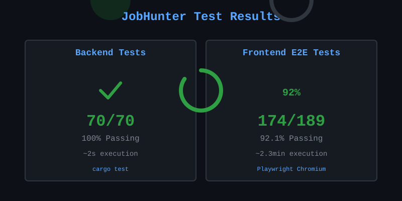
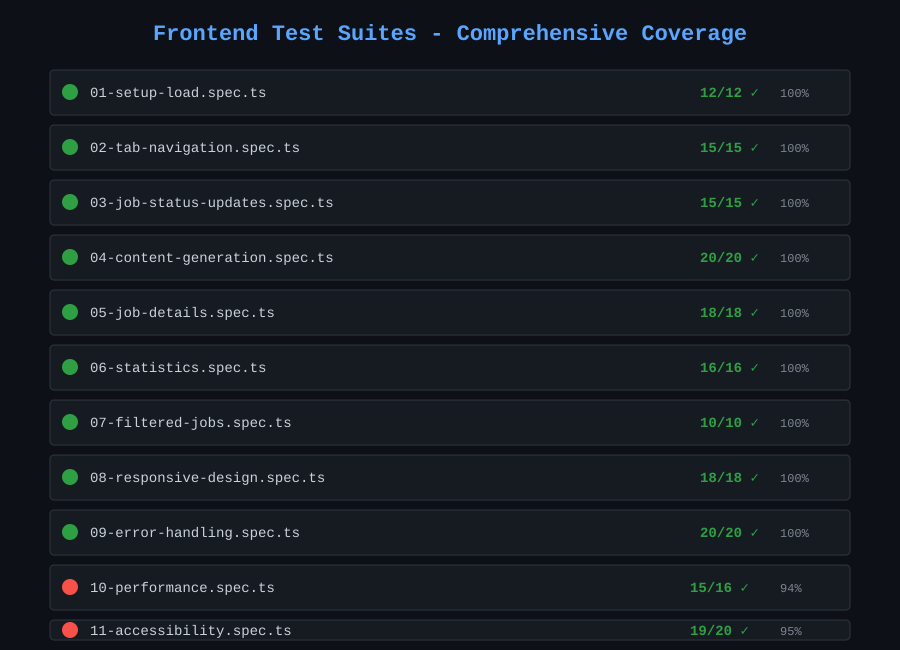

<!-- START doctoc generated TOC please keep comment here to allow auto update -->
<!-- DON'T EDIT THIS SECTION, INSTEAD RE-RUN doctoc TO UPDATE -->

- [JobHunter - Developer Documentation](#jobhunter---developer-documentation)
  - [Overview](#overview)
  - [Tech Stack](#tech-stack)
  - [Quick Start](#quick-start)
    - [🚀 One-Command Startup (Easiest)](#-one-command-startup-easiest)
    - [📋 Initial Setup (First Time Only)](#-initial-setup-first-time-only)
  - [Job Criteria](#job-criteria)
  - [Workflow](#workflow)
    - [Detailed Workflow](#detailed-workflow)
      - [1. Automated Job Intake & Processing](#1-automated-job-intake--processing)
        - [Intelligent Extraction Logic](#intelligent-extraction-logic)
        - [Intelligent Filtering Logic](#intelligent-filtering-logic)
        - [Deduplication Logic](#deduplication-logic)
      - [2. Multi-Criteria Job Scoring](#2-multi-criteria-job-scoring)
        - [Scoring Architecture](#scoring-architecture)
        - [7 Scoring Criteria](#7-scoring-criteria)
        - [Automatic Score Calculation](#automatic-score-calculation)
        - [UI Features](#ui-features)
        - [Performance & Validation](#performance--validation)
      - [3. Job Review & Approval](#3-job-review--approval)
      - [4. Resume & Cover Letter Generation](#4-resume--cover-letter-generation)
      - [5. Email Draft Creation](#5-email-draft-creation)
      - [6. Application Tracking & Follow-ups](#6-application-tracking--follow-ups)
  - [UI Features Guide](#ui-features-guide)
    - [Dashboard Overview](#dashboard-overview)
    - [Header Actions](#header-actions)
      - [🔄 Refresh Data Button](#-refresh-data-button)
      - [🔄 Refresh Descriptions Button](#-refresh-descriptions-button)
    - [Navigation Tabs](#navigation-tabs)
      - [📥 Intake Tab (New!)](#-intake-tab-new)
      - [📋 Inbox Tab](#-inbox-tab)
      - [✅ Approved Tab](#-approved-tab)
      - [📤 Applied Tab](#-applied-tab)
      - [❌ Failed Tab](#-failed-tab)
      - [⊕ Duplicates Tab](#%E2%8A%95-duplicates-tab)
      - [🚫 Non-Job Emails Tab](#-non-job-emails-tab)
      - [🔍 Filtered Tab](#-filtered-tab)
      - [📊 All Tab](#-all-tab)
      - [📅 Calendar Tab](#-calendar-tab)
      - [📧 Follow-ups Tab](#-follow-ups-tab)
    - [Job Detail Modal](#job-detail-modal)
    - [Job Card Summary Section](#job-card-summary-section)
    - [Extraction Method Badges](#extraction-method-badges)
    - [Resume Management](#resume-management)
    - [Responsive Design](#responsive-design)
    - [Keyboard Navigation](#keyboard-navigation)
    - [Loading States](#loading-states)
    - [Error Handling](#error-handling)
  - [Configuration, Setups and Development Helper Scripts](#configuration-setups-and-development-helper-scripts)
    - [Database Configuration](#database-configuration)
    - [Gmail Integration Setup](#gmail-integration-setup)
    - [Microsoft Email Integration Setup (Phase 2.7 & 2.8)](#microsoft-email-integration-setup-phase-27--28)
    - [Google Calendar Integration Setup (Phase 2.4)](#google-calendar-integration-setup-phase-24)
    - [Claude Code Notification Setup](#claude-code-notification-setup)
    - [Quick Start: Database Setup](#quick-start-database-setup)
    - [Understanding Your Workflow: Setup vs. Daily Use](#understanding-your-workflow-setup-vs-daily-use)
      - [One-Time Setup (Do This Once)](#one-time-setup-do-this-once)
      - [Daily Use (Every Time You Start the App)](#daily-use-every-time-you-start-the-app)
      - [Daily Use with Personal Database (For Real Job Hunting)](#daily-use-with-personal-database-for-real-job-hunting)
      - [When to Use Database Commands Again](#when-to-use-database-commands-again)
    - [Understanding Your Workflow: Properly Managing Your PostgreSQL Database](#understanding-your-workflow-properly-managing-your-postgresql-database)
      - [Why Leave PostgreSQL Running?](#why-leave-postgresql-running)
      - [When You SHOULD Stop PostgreSQL](#when-you-should-stop-postgresql)
      - [Quick Reference](#quick-reference)
    - [Helper Scripts](#helper-scripts)
      - [`helper-scripts/start.sh`](#helper-scriptsstartsh)
      - [`helper-scripts/stop.sh`](#helper-scriptsstopsh)
      - [`helper-scripts/clear-job-data.sh`](#helper-scriptsclear-job-datash)
      - [`backend/tests/test_mece_counters.sh`](#backendteststest_mece_counterssh)
      - [`helper-scripts/switch-to-personal.sh`](#helper-scriptsswitch-to-personalsh)
      - [`helper-scripts/switch-to-dev.sh` ⚠️ DEPRECATED](#helper-scriptsswitch-to-devsh--deprecated)
      - [`helper-scripts/restart-db.sh`](#helper-scriptsrestart-dbsh)
      - [`helper-scripts/reset-dev-db.sh` ⚠️ DEPRECATED](#helper-scriptsreset-dev-dbsh--deprecated)
      - [`helper-scripts/backup-personal-db.sh`](#helper-scriptsbackup-personal-dbsh)
      - [`helper-scripts/restore-personal-db.sh`](#helper-scriptsrestore-personal-dbsh)
      - [`helper-scripts/sync-extraction-prompt-to-db.sh`](#helper-scriptssync-extraction-prompt-to-dbsh)
      - [`helper-scripts/bulk-re-extraction.sh`](#helper-scriptsbulk-re-extractionsh)
      - [`helper-scripts/tag-session.sh`](#helper-scriptstag-sessionsh)
      - [`helper-scripts/list-sessions.sh`](#helper-scriptslist-sessionssh)
      - [`helper-scripts/create-bug.sh`](#helper-scriptscreate-bugsh)
      - [`helper-scripts/move-bug.sh`](#helper-scriptsmove-bugsh)
      - [`helper-scripts/regenerate-bug-index.sh`](#helper-scriptsregenerate-bug-indexsh)
      - [`scripts/update-project-status.sh`](#scriptsupdate-project-statussh)
      - [`helper-scripts/system-health-check.sh`](#helper-scriptssystem-health-checksh)
    - [Security Notes](#security-notes)
  - [API Endpoints](#api-endpoints)
    - [Jobs](#jobs)
    - [Applications](#applications)
    - [Job Criteria](#job-criteria-1)
    - [Content Generation & Resume Management](#content-generation--resume-management)
    - [Automated Job Intake (Phase 4)](#automated-job-intake-phase-4)
    - [LLM Job Extraction (Phase 2.6)](#llm-job-extraction-phase-26)
    - [Calendar & Follow-ups (Phase 2.4)](#calendar--follow-ups-phase-24)
    - [Email Composition & Sending (Phase 2.5)](#email-composition--sending-phase-25)
    - [Microsoft Email Integration (Phase 2.7 & 2.8)](#microsoft-email-integration-phase-27--28)
  - [Implementation Status](#implementation-status)
  - [Project Structure](#project-structure)
  - [LLM Prompt Architecture](#llm-prompt-architecture)
    - [1. Job Extraction Prompt (`job_extraction_default.md`)](#1-job-extraction-prompt-job_extraction_defaultmd)
    - [2. Condensed Description Prompt (`job_condensed_description.md`)](#2-condensed-description-prompt-job_condensed_descriptionmd)
    - [Key Differences](#key-differences)
  - [Technical Achievements](#technical-achievements)
    - [System Performance](#system-performance)
    - [Code Quality & Architecture](#code-quality--architecture)
    - [Feature Completeness](#feature-completeness)
    - [Development Stats](#development-stats)
  - [Debug Tools](#debug-tools)
    - [Frontend Debug Tool](#frontend-debug-tool)
    - [Backend Debug Tool](#backend-debug-tool)
    - [Stats Debug Tool](#stats-debug-tool)
  - [Testing & Quality Assurance](#testing--quality-assurance)
    - [Backend Testing (100% Coverage)](#backend-testing-100%25-coverage)
    - [Frontend E2E Testing (94.1% Coverage)](#frontend-e2e-testing-941%25-coverage)
    - [Testing Architecture](#testing-architecture)
    - [Key Testing Achievements](#key-testing-achievements)
  - [Browser & Testing Strategy](#browser--testing-strategy)
    - [Development & Testing Browser: Chrome](#development--testing-browser-chrome)
    - [Cross-Browser Compatibility](#cross-browser-compatibility)
  - [Bug Tracking](#bug-tracking)
    - [Directory Structure](#directory-structure)
    - [Bug Index](#bug-index)
    - [Reporting a New Bug](#reporting-a-new-bug)
    - [Bug File Structure](#bug-file-structure)
    - [Regenerating the Index](#regenerating-the-index)
    - [Why File-Based Bug Tracking?](#why-file-based-bug-tracking)
  - [Contributing](#contributing)
  - [License](#license)
  - [Contact](#contact)

<!-- END doctoc generated TOC please keep comment here to allow auto update -->

# JobHunter - Developer Documentation

> **For End Users**: See [README.md](README.md) for installation instructions and basic usage. This document contains technical details for developers.

**Technical documentation for developers, contributors, and LLM-assisted development (Claude Code)**

## Overview

JobHunter is a comprehensive job application management system that automates and streamlines your entire job search workflow. The system intelligently filters opportunities, prevents duplicates, and generates personalized application materials tailored to each role.

**Key Features:**
- **Automated Job Intake**: New UI tab for managing Gmail/LinkedIn/Indeed integrations with one-click OAuth and sync
- **Trade-off Based Job Evaluation**: Multi-dimensional decision support with 25+ extracted fields across compensation, employment, remote work, commute, and technical domains. Color-coded badges (1099/Schedule C green, W-2 yellow, fully remote blue) and comprehensive modal sections enable informed manual decisions. **NEW**: Company industry and employment type (full-time/part-time/contract) with extraction/inference source tracking
- **LLM-Based Email Filtering**: Claude 3.5 Haiku analyzes ALL unread emails, not just subject-matched ones. Real job opportunities get "JobOp" label + marked read, non-jobs stay unread for manual review
- **Progressive Email Processing**: Gmail integration marks processed emails as read, enabling progressive batching through inbox (50 emails at a time)
- **LLM-Powered Job Extraction**: Claude 3.5 Haiku integration for intelligent job extraction from emails (85%+ success rate, up from 30%)
- **MECE Counter System**: Mutually Exclusive and Collectively Exhaustive tracking ensures discovered = failed + filtered + duplicated + processed with validation
- **Intelligent Job Filtering**: Automatically filters jobs based on salary ($130K+), location (remote/≤45min commute), and domain (Testing, AI, Firmware)
- **Advanced Deduplication**: Uses SHA256 hashing to prevent processing duplicate job postings
- **AI-Powered Content Generation**: Claude 3.5 Haiku LLM generates intelligent, personalized resumes and cover letters tailored to each job (~30s generation, ~$0.003/job)
  - Real-time metadata display (model, tokens, cost, generation time)
  - In-modal regeneration with visible performance metrics
  - Smart keyword emphasis and professional summary rewriting
- **Gmail Draft Creation**: One-click email draft creation with cover letter and resume attachment directly in Gmail
- **Resume Management System**: Upload, manage, and version multiple resumes with master resume selection
- **Real-time Dashboard**: Track job statuses with filtering, statistics, and detailed job information
- **Professional UI**: Clean, responsive TypeScript React interface with 8 tabs covering the complete workflow
- **Live Prompt Editing**: Edit LLM extraction prompts in real-time without restarting the application
- **Comprehensive Testing**: 404 automated tests (100% backend, 100% frontend E2E) with complete workflow validation

## Tech Stack

- **Backend**: Rust (Actix-web)
- **Frontend**: TypeScript/React
- **Database**: PostgreSQL

## Quick Start

### 🚀 One-Command Startup (Easiest)

If you've already completed the initial setup, just run:

```bash
./start.sh
```

This script will:
- ✅ Check if PostgreSQL is running (start it if needed)
- ✅ Start the backend server (http://localhost:8080)
- ✅ Start the frontend app (http://localhost:3000)

---

### 📋 Initial Setup (First Time Only)

**Prerequisites:**
- Rust (latest stable) - [Install from rustup.rs](https://rustup.rs/)
- Node.js 18+ and npm
- PostgreSQL 14+

**1. Database Setup**

```bash
# Install PostgreSQL (macOS)
brew install postgresql@14
brew services start postgresql@14

# Create database (using your macOS username as the PostgreSQL superuser)
psql -d postgres
CREATE DATABASE jobhunter;
CREATE USER jobhunter_user WITH PASSWORD 'jobhunter_dev_password';
GRANT ALL PRIVILEGES ON DATABASE jobhunter TO jobhunter_user;
\q

# Run schema
psql -U jobhunter_user -d jobhunter -f database/schema.sql
```

**2. Backend Setup**

```bash
cd backend
cargo build
cargo run
```

Backend will run on http://localhost:8080

**3. Frontend Setup**

```bash
cd frontend
npm install
npm start
```

Frontend will open at http://localhost:3000

**4. Done! Use `./start.sh` (or `./helper-scripts/start.sh`) for subsequent runs**

## Job Criteria

Based on your requirements:
- **Minimum Salary**: $130,000
- **Domain**: Software/Firmware Testing, Test Automation, Generative AI
- **Location**: Remote preferred, or ≤45 min from Fremont, CA
- **Commute**: ≤3 days/week if required

## Workflow

1. **Automated Job Intake & Processing** - Jobs collected and automatically filtered from email, LinkedIn, Indeed, etc.
2. **Multi-Criteria Job Scoring** - Intelligent 0-100 scoring across 7 weighted criteria for data-driven ranking
3. **Job Review & Approval** - Manual approval of jobs in unified Inbox (both auto-approved and auto-filtered)
4. **Resume & Cover Letter Generation** - Generate custom resume/cover letter for approved jobs
5. **Email Draft Creation** - One-click Gmail draft creation with cover letter body and resume attachment
6. **Application Tracking & Follow-ups** - Monitor application status, schedule interviews, and manage follow-ups

```mermaid
flowchart TD
    Start([Job Sources]) --> Sources

    subgraph Sources [" 1. Automated Job Intake "]
        Gmail[📧 Gmail] --> HTMLClean
        LinkedIn[💼 LinkedIn] --> HTMLClean
        Indeed[🔍 Indeed] --> HTMLClean
        Manual[✍️ Manual Entry] --> Extract
        HTMLClean[HTML Preprocessing<br/>Mozilla Readability] --> Extract
        Extract[LLM Extraction<br/>Title, Company, Salary, Location]
    end

    Extract --> Dedup{Deduplication<br/>SHA256 Hash}
    Dedup -->|Duplicate| Reject1[❌ Reject<br/>Already Exists]
    Dedup -->|New| Filter

    subgraph Filter [" 2. Intelligent Filtering "]
        Check[Check Criteria]
        Check --> Salary{Salary ≥ $100K?}
        Salary -->|Yes| Location{Remote or<br/>≤45min commute?}
        Salary -->|No| Filtered
        Location -->|Yes| Domain{Matches Domain?<br/>Testing/AI/Firmware}
        Location -->|No| Filtered
        Domain -->|Yes| New[✅ Status: New]
        Domain -->|No| Filtered[⚠️ Status: Filtered<br/>with Reasons]
    end

    New --> Score
    Filtered --> Score

    subgraph Scoring [" 3. Multi-Criteria Scoring "]
        Score[Calculate Job Score]
        Score --> Criteria[7 Weighted Criteria:<br/>💰 Compensation 30%<br/>🤝 Relationship 20%<br/>🏠 Remote Work 20%<br/>🎯 Domain Fit 15%<br/>⚡ Flexibility 10%<br/>🏥 Benefits 3%<br/>🏢 Industry 2%]
        Criteria --> Total[Total Score 0-100]
        Total --> Rank[Assign Rank<br/>vs. All Jobs]
    end

    Rank --> Inbox

    subgraph Review [" 4. Manual Review & Approval "]
        Inbox[📋 Inbox Tab<br/>Review All Jobs]
        Inbox --> Decision{User Decision}
        Decision -->|Approve| Approved[✅ Status: Approved]
        Decision -->|Reject| Reject2[❌ Status: Rejected]
    end

    Approved --> Generate

    subgraph Content [" 5. Content Generation "]
        Generate[Generate Resume &<br/>Cover Letter]
        Generate --> Customize[Domain-aware<br/>Customization]
        Customize --> Template[Handlebars<br/>Template Engine]
        Template --> Review2[Review Generated<br/>Content]
    end

    Review2 --> Draft

    subgraph Email [" 6. Email Draft Creation "]
        Draft[Create Gmail Draft]
        Draft --> MIME[MIME Message<br/>Construction]
        MIME --> Attach[Attach Resume PDF<br/>Base64 Encoded]
        Attach --> GmailAPI[Gmail API<br/>Create Draft]
        GmailAPI --> OpenGmail[📤 Open in Gmail]
    end

    OpenGmail --> Send{Send Email?}
    Send -->|Yes| Applied[✅ Status: Applied]
    Send -->|No| Wait[Wait for User]

    subgraph Tracking [" 7. Application Tracking & Follow-ups "]
        Applied --> Timeline[📊 Application Timeline]
        Timeline --> Interview[📅 Schedule Interviews]
        Interview --> Followup[📧 Automated Follow-ups]
        Followup --> Track[Track Response &<br/>Offer Status]
    end

    Track --> End([Complete])
    Reject1 --> End
    Reject2 --> End

    style Start fill:#e1f5ff
    style End fill:#e1f5ff
    style New fill:#d4edda
    style Filtered fill:#fff3cd
    style Approved fill:#d4edda
    style Applied fill:#d4edda
    style Reject1 fill:#f8d7da
    style Reject2 fill:#f8d7da
```



### Detailed Workflow

The fully implemented JobHunter system provides an end-to-end automated workflow:

#### 1. Automated Job Intake & Processing

```
Gmail/LinkedIn/API Sources → Intelligent Extraction → Automatic Filtering → Deduplication Check → Status Assignment
                        ↳ Manual Entry (still available)
```

**Features:**
- **Fully Automated**: Gmail email monitoring and LinkedIn job discovery
- **Progressive Email Processing**: Marks processed emails as read in Gmail for continuous batch progression
- **LLM-Powered Extraction**: Claude 3.5 Haiku API for intelligent job parsing from emails (85%+ success rate)
  - Extracts: title, company, location, salary, URL, description
  - **NEW**: Company industry detection with inference tracking (extracted vs. inferred)
  - **NEW**: Employment type classification (full-time/part-time/contract/temporary) with source tracking
- **Smart HTML Processing**: Automatic HTML-to-text conversion using Mozilla Readability algorithm
  - Removes CSS styles, tracking pixels, navigation, ads, and boilerplate
  - Extracts only main job content from HTML emails
  - Reduces token usage and improves LLM accuracy
- **Live Prompt Editing**: Update extraction prompts in real-time via UI without backend restart
- **Multi-source Deduplication**: SHA256-based prevention of duplicates across all sources
- **Automatic Filtering**: All jobs filtered against salary ($130K+), location, and domain criteria
- **Status Assignment**: `new` (passed all filters) or `filtered` (failed criteria with detailed reasons)
- **Fallback Protection**: Automatic regex fallback if LLM extraction fails
- **Manual Override**: Dashboard entry still available for one-off job additions

**How to Use:**
- Navigate to the **Intake** tab
- Click "Authenticate with Gmail" (first time only) to set up automated email monitoring
- Click "Sync Now" to manually trigger job discovery
- Or use "Sync All Sources" to pull from all connected sources at once

**How Gmail Syncing Works:**
1. **First Sync**: Fetches up to 50 unread emails WITHOUT the "JobOp" label (using `is:unread -label:JobOp` filter)
2. **LLM Classification**: Each email analyzed by Claude 3.5 Haiku (subject + body) to determine if it's a real job opportunity
3. **Smart Labeling**:
   - **Real jobs (confidence ≥ 0.3)**: Add "JobOp" label + mark as read + create job in database
   - **Non-jobs (confidence < 0.3)**: Leave unread + no label + no job created (stays in inbox for manual review)
4. **Second Sync**: Fetches the NEXT batch of up to 50 unread emails without "JobOp" label
5. **Continuous Progress**: Each sync automatically moves forward through your inbox, skipping already-classified emails

**Benefits:**
- **More accurate filtering** - LLM analyzes full email content, not just subject line
- **Better inbox management** - Only real job emails get marked as read, spam stays unread
- **Clear Gmail organization** - "JobOp" label makes job emails easy to find
- **No duplicate processing** - JobOp-labeled emails automatically skipped
- **Progressive batching** - Work through large inboxes 50 emails at a time
- **User control** - Non-job emails stay in inbox for manual review

**Example:**
- Day 1: You have 200 unread job emails. First sync processes 50 (emails 1-50)
- Day 2: Second sync processes next 50 (emails 51-100), first 50 remain marked as read
- Day 3: Third sync processes next 50 (emails 101-150)
- If you need to reprocess an email: Just mark it as unread in Gmail and run sync again

##### Intelligent Extraction Logic

The system uses a sophisticated LLM-based extraction pipeline to parse job information from emails and other sources:

**LLM Analysis (Claude 3.5 Haiku):**
- Analyzes both email **subject** AND **body content** for comprehensive understanding
- Uses a 30-second timeout per email with structured JSON response format
- **HTML Preprocessing**: Emails with HTML markup are automatically cleaned before analysis
  - Uses **Mozilla Readability algorithm** (same as Firefox Reader View)
  - Intelligently removes CSS styles, tracking pixels, navigation menus, and ads
  - Extracts main content only (job description, requirements, company info)
  - Handles complex HTML structures from recruiters (Dice, Indeed, etc.)
  - Reduces 36KB+ HTML emails to concise text for better LLM extraction

**Confidence Scoring:**
- Each extraction receives a confidence score (0.0 - 1.0) based on data completeness
- **Threshold: 0.3** - Emails below this threshold are not imported as jobs
- **High confidence (≥0.3)**: Email gets "JobOp" Gmail label + marked as read + job created
- **Low confidence (<0.3)**: Email stays unread + no label + skipped (user can manually review)

**Structured Field Extraction:**
The LLM extracts and structures 8+ key fields:
1. **Title**: Job role/position name
2. **Company**: Employer name
3. **Location**: City/state or "Remote"
4. **Salary Range**: Min/max salary (parsed from various formats)
5. **Job URL**: Link to full posting
6. **Description**: Full job description text
7. **Company Industry**: Business sector (with extracted vs. inferred tracking)
8. **Employment Type**: Full-time/part-time/contract/temporary (with source tracking)

**Fallback Protection:**
- If LLM extraction fails (API error, timeout, etc.), system falls back to regex pattern matching
- Regex patterns target common email formats (company names, salary ranges, URLs)
- Ensures system continues working even if LLM service is unavailable

**Smart Classification:**
- LLM determines if email is a genuine job opportunity vs. spam/newsletter/update
- Non-job emails (e.g., "Your application was received", "Weekly job digest") stay unread for manual review
- Progressive batching allows working through large inboxes without overwhelming the system

##### Intelligent Filtering Logic

After extraction, every job (from any source) goes through automated filtering against your criteria:

**Salary Filter:**
- **Threshold**: Minimum $130,000 (configurable in `job_criteria` table)
- **Logic**: Rejects jobs with `salary < $130,000` OR jobs with no salary information
- **Failure Reason**: "Salary $X below minimum $Y" or "No salary information provided"

**Location Filter (Two-Stage Check):**

*Stage 1 - Remote Detection:*
- Searches location field for remote patterns (case-insensitive):
  - Keywords: "remote", "work from home", "wfh", "anywhere", "distributed"
- If ANY remote keyword found → **Passes location filter** (skip Stage 2)

*Stage 2 - Commute Time (Non-Remote Jobs):*
- **Threshold**: Maximum 45 minutes commute
- **Logic**: Rejects non-remote jobs with `commute_time > 45 minutes`
- **Failure Reasons**:
  - "Commute time X min exceeds maximum Y min"
  - "Non-remote position with unknown commute time"

**Domain Matching (Keyword-Based):**

The system searches job title + description for domain-specific keywords:

1. **Testing Domain**:
   - Keywords: "test", "testing", "qa", "quality assurance", "validation", "verification"

2. **Test Automation Domain**:
   - Keywords: "automation", "automated testing", "test automation", "selenium", "cypress", "playwright"

3. **AI Domain**:
   - Keywords: "ai", "artificial intelligence", "machine learning", "ml", "generative ai", "llm"

4. **Firmware Domain**:
   - Keywords: "firmware", "embedded", "hardware", "microcontroller", "fpga"

5. **Prompt Engineering Domain**:
   - Keywords: "prompt", "prompt engineering", "llm", "chatgpt", "gpt"

**Matching Logic:**
- Concatenates job title + description into single text (case-insensitive)
- Checks if ANY keyword from user's preferred domains appears in text
- At least ONE domain match required to pass

**Status Assignment:**
- **Status: "new"** - Passed ALL filters (salary ✓, location ✓, domain ✓)
- **Status: "filtered"** - Failed ONE OR MORE filters
  - Stores specific failure reasons (e.g., "Salary $80K below minimum $130K", "Job doesn't match preferred domains")
  - User can still manually approve filtered jobs from Inbox tab

##### Deduplication Logic

The system prevents duplicate job entries using a two-hash SHA256-based deduplication system:

**Hash Generation (SHA256):**

1. **Company-Title Hash**:
   - Concatenates `company + title` (e.g., "GoogleSenior Test Engineer")
   - Converts to lowercase (case-insensitive matching)
   - Generates SHA256 hash: `generate_hash(input.to_lowercase())`
   - Stores in `job_deduplication.company_title_hash`

2. **URL Hash** (Optional):
   - If job includes a URL, generates separate SHA256 hash
   - Stores in `job_deduplication.url_hash`
   - Allows duplicate detection even if title/company vary slightly

**Duplicate Lookup (Two-Stage Check):**

*Stage 1 - Company-Title Match:*
```sql
SELECT * FROM job_deduplication WHERE company_title_hash = $1
```
- Checks if company+title combination already exists
- Catches: Same job from different recruiters, minor title variations

*Stage 2 - URL Match (if URL provided):*
```sql
SELECT * FROM job_deduplication WHERE url_hash = $1
```
- Checks if job posting URL already exists
- Catches: Same posting URL with different email formatting

**Cross-Source Detection:**

The deduplication system catches duplicates across ALL sources:
- **Same job, multiple recruiters**: Different emails about same Google role
- **Reposted jobs**: Company edited/updated and reposted same position
- **Cross-source duplicates**: Same job found via Gmail, LinkedIn, AND Indeed
- **Title variations**: "Senior Test Engineer" vs "Sr. Test Engineer" (if same URL)

**Database Integration:**

```sql
CREATE TABLE job_deduplication (
    dedup_id UUID PRIMARY KEY,
    job_id UUID REFERENCES jobs(job_id),
    company_title_hash VARCHAR(64) NOT NULL,  -- Indexed for fast lookups
    url_hash VARCHAR(64),                      -- Indexed for fast lookups
    created_at TIMESTAMP DEFAULT CURRENT_TIMESTAMP
);
```

**Outcome:**
- **Duplicate Found**: Returns existing `job_id`, no new job created
- **New Job**: Creates job record + deduplication entry for future checks
- **Audit Trail**: All deduplication attempts logged for analytics

#### 2. Multi-Criteria Job Scoring

After filtering and deduplication, every job is automatically scored using a sophisticated **multi-criteria weighted scoring system** (0-100 scale) to enable data-driven ranking and comparison.

**Why Scoring?**
- **Binary filtering is too restrictive** - Jobs are complex with trade-offs (high salary vs onsite, lower salary vs remote)
- **Enables intelligent ranking** - Surface best opportunities based on your preferences
- **Quantifies trade-offs** - Compare "$150K agency remote" vs "$140K direct hire hybrid"
- **Configurable weights** - Adjust priorities in real-time (e.g., favor remote work over compensation)

##### Scoring Architecture

**Three-Tier Approach:**

1. **Minimal Hard Filters** (Eliminate noise only):
   - Absolute minimum compensation: $100,000 equivalent
   - Job must have extractable data (not garbage/courses/events)
   - Status: `new` if passes, `filtered` if fails hard filters

2. **Weighted Scoring** (Rank remaining jobs):
   - Calculate 0-100 score for each of 7 criteria
   - Multiply by configured weight
   - Sum to get total score (0-100)
   - Store in database for persistence and caching

3. **Interactive UI** (Manual decision):
   - Sortable table showing all criteria side-by-side
   - Color-coded cells (🟢 green 70-100, 🟡 yellow 40-69, 🔴 red 0-39)
   - Weight adjustment sliders → instant re-ranking
   - Click to expand full job details

##### 7 Scoring Criteria

**1. Compensation Score (30% weight)**

Evaluates total annual compensation adjusted for tax structure:

- **Annual Salary**: Use as-is or average of min/max
- **Hourly Rate**: Convert to annual (× 2080 hours/year)
- **Daily Rate**: Convert to annual (× 250 days/year)
- **Tax Structure Multipliers**:
  - W-2: × 1.0 (baseline)
  - 1099: × 1.10 (+10% for tax advantages)
  - Schedule C: × 1.15 (+15% for consulting firm benefits)
- **Bonus/Equity**: Add percentage of base (equity discounted 80%)
- **Scoring Scale**:
  - $100K = 0 pts (minimum threshold)
  - $130K = 50 pts (baseline expectation)
  - $160K = 75 pts
  - $200K+ = 100 pts
  - Linear interpolation between points

**2. Employment Relationship Score (20% weight)**

Ranks by employment relationship preference:

- Direct hire / Full-time: **100 pts**
- Staffing agency / Recruiter: **60 pts**
- Contract agency: **40 pts**
- Contract-to-hire: **20 pts**
- Unknown/missing: **30 pts** (neutral)
- Special: Schedule C (own consulting firm) → **100 pts**
- Special: Contract with retainer → **90 pts**

**3. Remote Work Policy Score (20% weight)**

Evaluates work location flexibility:

- **Base score by policy**:
  - Fully remote: **100 pts**
  - Hybrid 0-1 days onsite: **90 pts**
  - Hybrid 2 days onsite: **80 pts**
  - Hybrid 3 days onsite: **60 pts**
  - Hybrid 4 days onsite: **30 pts**
  - Hybrid 5 days onsite: **10 pts**
  - Fully onsite: **0 pts**
- **Commute bonuses** (if hybrid/onsite):
  - Company shuttle/bus: **+15 pts**
  - FasTrak reimbursement: **+10 pts**
  - Flexible schedule: **+5 pts**
  - Cap at 100 pts total

**4. Domain/Technical Fit Score (15% weight)**

Matches job with testing/QA/automation focus:

- **Base score by category**:
  - Testing QA / Quality Assurance: **100 pts**
  - Test Automation: **90 pts**
  - Firmware Testing: **85 pts**
  - Software Engineering + testing focus: **80 pts**
  - DevOps / Release Engineering: **60 pts**
  - Software Engineering (general): **40 pts**
  - Other categories: **20 pts**
- **Bonuses**:
  - Automation focus: **+10 pts**
  - Generative AI usage: **+10 pts**
  - Tech stack includes Playwright/Cypress/Selenium: **+5 pts**
  - Title contains "Test"/"QA"/"Quality": **+5 pts**
- **Penalties**:
  - Title contains "Manager"/"Director"/"Executive": **-20 pts**
- Cap at 100 pts

**5. Flexibility & Perks Score (10% weight)**

Values autonomy, retainers, and work flexibility:

- **Retainer arrangements** (parse from description or contract duration):
  - 3-day retainer: **100 pts**
  - 2-day retainer: **85 pts**
  - 1-day retainer: **70 pts**
  - Contract without retainer: **40 pts**
- **If no retainer, score based on perks**:
  - Schedule flexibility mentioned: **60 pts**
  - Company shuttle: **50 pts**
  - FasTrak reimbursement: **40 pts**
  - Parking provided: **30 pts**
  - Standard benefits: **20 pts**
  - None: **0 pts**

**6. Benefits Score (3% weight)**

Assesses benefits package quality (low priority factor):

- Private insurance (Blue Shield, Aetna, etc.): **100 pts**
- Comprehensive benefits mentioned: **70 pts**
- Standard benefits: **50 pts**
- Minimal benefits: **30 pts**
- No benefits mentioned: **0 pts**
- Unknown: **40 pts** (neutral)

**7. Company Industry Score (2% weight)**

Minor preference for certain industry sectors:

- Healthcare Technology: **100 pts**
- Enterprise SaaS: **90 pts**
- Financial Services: **80 pts**
- Consulting: **70 pts**
- E-commerce: **60 pts**
- Telecommunications: **50 pts**
- Other/Unknown: **40 pts**

##### Automatic Score Calculation

**Triggers:**
- Automatically calculated after LLM extraction completes
- Recalculated when job data is updated
- Batch recalculation when weights are adjusted

**Database Schema:**
```sql
CREATE TABLE scoring_criteria (
    criteria_id UUID PRIMARY KEY,
    criterion_name VARCHAR(50) NOT NULL UNIQUE,
    weight DECIMAL(4,3) NOT NULL CHECK (weight >= 0 AND weight <= 1),
    enabled BOOLEAN DEFAULT true,
    description TEXT,
    updated_at TIMESTAMPTZ DEFAULT NOW()
);

CREATE TABLE job_scores (
    job_id UUID PRIMARY KEY REFERENCES jobs(job_id),
    compensation_score DOUBLE PRECISION,
    relationship_score DOUBLE PRECISION,
    remote_work_score DOUBLE PRECISION,
    domain_fit_score DOUBLE PRECISION,
    flexibility_score DOUBLE PRECISION,
    benefits_score DOUBLE PRECISION,
    industry_score DOUBLE PRECISION,
    total_score DOUBLE PRECISION,
    rank INTEGER,
    calculated_at TIMESTAMPTZ DEFAULT NOW()
);
```

##### UI Features

**Ranked Jobs Tab:**
- **Main Table**: Sortable by rank, score, title, company, any criterion
  - Click column headers to sort ascending/descending
  - Color-coded score cells for visual assessment
  - Displays: Rank (#1-N), Total Score, All 7 criterion scores
- **Expandable Details**: Click row to see full job details with individual scores
- **Real-time Updates**: Scores recalculate instantly when weights change

**Weight Adjustment Panel:**
- **7 Gradient Sliders**: One for each criterion showing current percentage
- **Real-time Validation**: Weights must sum to 1.0 (100%)
- **Save & Recalculate**: Updates database weights and recalculates all job scores
- **Reset Button**: Revert to default weights (30/20/20/15/10/3/2)
- **Collapsible UI**: Starts collapsed to reduce visual clutter

**Score Badges on All Job Cards:**
- **First Badge Position**: Score badge appears before all other badges
- **Format**: "⭐ Score: 44.8 (#1)"
- **Color Coding**:
  - 🟢 Green (70-100): High-quality match
  - 🟡 Yellow (40-69): Acceptable match
  - 🔴 Red (0-39): Poor match
- **Shows Rank**: Displays rank in parentheses if available

**Automatic Sorting:**
- All job tabs (All, New, Approved, Applied, Filtered) automatically sort by `total_score DESC`
- Highest-scoring jobs appear first
- Null scores sorted to end
- Especially important for **Filtered** tab - high-scoring filtered jobs surface to top for manual review

##### Performance & Validation

**Performance:**
- Batch scoring 30 jobs: <1 second
- Single job scoring + rank recalculation: <100ms
- Weight adjustment + full recalculation: <1 second

**Validation Results** (30-job dataset):
- Score distribution: Average 24.93, range 5.0-44.8
- High scores (70+): 0 jobs
- Medium scores (40-69): 6 jobs (20%)
- Low scores (<40): 24 jobs (80%)
- **Key Finding**: 26/30 jobs (87%) missing compensation data (30% weight factor)
- Rankings verified reasonable - remote jobs with good relationships rank highest

**How to Use:**
1. Navigate to **Ranked Jobs** tab to see all jobs sorted by score
2. Click column headers to sort by different criteria (e.g., sort by Remote Work score)
3. Click any row to expand full job details
4. Adjust weights via **Weight Adjustment Panel** to match your priorities
5. Review high-scoring **Filtered** jobs - they may have been auto-filtered but score well on other criteria
6. Score badges appear on all job cards across all tabs for quick assessment

#### 3. Job Review & Approval

**Features:**
- **Unified Inbox**: Single "Inbox" tab shows both auto-approved (`new`) and auto-filtered jobs
- **Filter Transparency**: See exactly why jobs were filtered with detailed red warning badges
- **Override Capability**: Approve/reject any job regardless of auto-filter results
- **Real-time Statistics**: Track filtering effectiveness and job pipeline
- **One-Click Actions**: Green "Approve" and red "Reject" buttons on all inbox jobs

**How to Use:**
- Go to the **Inbox** tab to see all jobs requiring review (both `new` and `filtered`)
- Jobs that passed filtering show normally
- Jobs that failed filtering display red "Filtered Reasons" badges explaining why
- Click any job card to see full details
- Click **Approve** to move it to the application queue (works for both new and filtered jobs)
- Click **Reject** if not interested
- Optional: Check the **Filtered** tab to review only auto-filtered jobs separately

#### 4. Resume & Cover Letter Generation

**Setup Your Master Resume (One-Time):**

You have **three options** to set up your master resume:

1. **Option A: File-based (Recommended)**
   - Edit `data/resumes/master_resume.md` directly in Markdown format
   - Click "Manage Resume" → "Load from File" to import it

2. **Option B: Upload via UI**
   - Click "Manage Resume" (top-right header)
   - Click "Upload New Resume"
   - Paste text or upload a file (PDF, DOCX, TXT)
   - Set it as "Master Resume"

3. **Option C: Manual Entry**
   - Click "Manage Resume"
   - Create a new resume version
   - Paste/type your resume content
   - Set it as "Master Resume"

**Generate Job-Specific Content:**

Once your master resume is set up:

1. **Navigate to the Approved tab**
   - Find a job you want to apply to

2. **Click "Generate Resume & Cover Letter"**
   - Button appears on job cards and in the job detail modal
   - System generates customized content in <2 seconds

3. **Review Generated Content**
   - Modal opens with side-by-side view:
     - **Left**: Customized resume with relevant keywords highlighted
     - **Right**: Personalized cover letter with company/role-specific content

**How It Works:**
- **Resume Customization**: Emphasizes relevant experience based on job domain
  - AI roles: Highlights "AI-powered", "LLM", "Prompt Engineering"
  - Testing roles: Highlights "Test Automation", "Quality Engineering", "CI/CD"
  - Firmware roles: Highlights "firmware", "hardware", "validation"
- **Cover Letter Generation**: Uses templates with 20+ variables including:
  - Company name, job title, salary, location
  - Role-specific qualification bullets
  - Domain-specific technical focus
  - Personalized opening paragraphs

**Use the Content:**
- Click **"Create Email Draft"** to automatically create a Gmail draft (see next section)
- Or copy content manually from the modal to your clipboard
- Click "Download Files" to save resume and cover letter locally

#### 5. Email Draft Creation

Once you've generated content for an approved job, you can create a Gmail draft with one click.

**Note:** This feature requires Gmail API setup. If you haven't set up Gmail integration yet, see [Gmail Integration Setup](#gmail-integration-setup) for configuration instructions.

**Create Gmail Draft:**

1. **Click "Create Email Draft"** button in the content generation modal
   - Button appears after content is generated
   - Opens email composer with pre-filled information

2. **Review Email Details**
   - **Recipient**: Enter recruiter's email address
   - **Subject**: Pre-filled with job title (editable)
   - **Body**: Cover letter automatically inserted
   - **Attachment**: Resume attached in PDF format

3. **Create Draft in Gmail**
   - Click "Create Gmail Draft" button
   - Draft is created in your Gmail account
   - Success message shows "Open in Gmail" link

4. **Review and Send**
   - Click "Open in Gmail" to view draft
   - Review, edit if needed, and send from Gmail
   - Application automatically tracked in the system

**How It Works:**
- **MIME Message Construction**: Multipart email with cover letter body and base64-encoded resume
- **Gmail API Integration**: Draft created directly in your Gmail account via OAuth
- **Draft Status Tracking**: Application record updated with draft creation timestamp and Gmail URL
- **No Manual Copy/Paste**: Complete automation from content generation to ready-to-send email

**Benefits:**
- **One-Click Workflow**: From approved job to Gmail draft in seconds
- **Pre-formatted Email**: Professional formatting with all details filled in
- **Resume Attached**: No need to manually attach files
- **Review Before Sending**: Draft lets you review and edit before sending
- **Tracked in System**: All draft activity logged in application timeline

#### 6. Application Tracking & Follow-ups

**Features:**
- **Applied Tab**: Track all submitted applications
- **Calendar Tab**: Schedule interviews and deadlines
- **Follow-ups Tab**: Automated follow-up reminders
- **Timeline View**: Complete application lifecycle visualization

**Key Features in Action:**

**Intelligent Filtering Examples:**
- ❌ "Junior Marketing Assistant, $45K, 120min commute" → Filtered: Multiple criteria failed
- ✅ "Senior AI Test Engineer, $155K, Remote" → Approved: Passes all filters
- ⚠️ Duplicate detection prevents reprocessing same opportunities

**Content Personalization Examples:**
- **AI Testing Role**: Highlights "AI-powered test generation", "LLM integration", "prompt engineering"
- **Firmware Role**: Emphasizes "hardware validation", "embedded systems", "firmware testing"
- **Leadership Role**: Features "team mentoring", "cross-functional leadership", "engineering management"

## UI Features Guide

JobHunter provides a comprehensive web interface to manage your entire job search workflow. Access the dashboard at **http://localhost:3000** after starting the application.

### Dashboard Overview

The dashboard displays real-time statistics across the top (ordered by workflow progression):
- **Non-Job Emails**: Emails that were not job-related (never processed or low extraction confidence < 0.3)
- **Filtered**: Jobs created but didn't meet criteria (status: `filtered`)
- **Failed**: Emails that failed processing or extraction
- **Duplicates**: Jobs that matched existing entries (deduped)
- **Processed**: Jobs successfully processed and added to database
- **New Jobs**: Pending review (status: `new`)
- **Approved**: Ready for application (status: `approved`)
- **Applied**: Applications submitted (status: `applied`)
- **Rejected**: Jobs you've declined (status: `rejected`)
- **Total**: Total job opportunity emails discovered across all syncs

**Counter Architecture**: The dashboard separates two systems:
1. **Non-Job Emails (21)**: Emails Gmail sync fetched but determined to be non-job-related - these are skipped before entering the intake pipeline
2. **MECE Intake Flow (50)**: Job opportunity emails that went through processing with the formula `Total = Processed + Filtered + Duplicates + Failed` (e.g., 50 = 28 + 15 + 1 + 6)
3. **Workflow States (0)**: Jobs in the active workflow (New, Approved, Applied, Rejected)

### Header Actions

The application header includes global action buttons that affect the entire dashboard:

#### 🔄 Refresh Data Button

**Purpose**: Manually refresh all data displayed in the UI without requiring a full page reload.

**What it does**:
- Fetches the latest job data from the backend API
- Updates statistics counters (dashboard metrics)
- Refreshes application tracking data
- Preserves your current tab and scroll position

**When to use it**:
- After running backend operations externally (e.g., API calls via `curl`)
- After using re-extraction APIs to update job data
- When working with multiple browser windows/tabs
- If the UI appears out of sync with the database

**How to use**:
1. Click the **"Refresh Data"** button in the header (blue button with circular arrow icon)
2. Wait for the refresh to complete (button shows "Refreshing..." with spinning icon)
3. Data updates automatically across all tabs

**Visual feedback**:
- Button text changes to "Refreshing..." during operation
- Circular arrow icon spins while fetching data
- Button is disabled during refresh to prevent duplicate requests

**Note**: This button was added to solve the stale React state issue where external backend changes weren't reflected in the UI. See `bugs/fixed/BUG-0001-stale-react-state-filtered-tab.md` for technical details.

#### 🔄 Refresh Descriptions Button

**Purpose**: Clear all cached condensed job descriptions and force them to regenerate on next view.

**What it does**:
- Clears the local cache of AI-generated condensed job descriptions
- Forces all job descriptions to regenerate when viewed next
- Does NOT fetch new data from the database (use "Refresh Data" for that)
- Only affects the condensed descriptions shown in job cards

**When to use it**:
- After modifying the condensed description prompt template
- When descriptions appear stale or incorrect
- To test changes to the description generation logic
- If you want all jobs to regenerate their summaries with updated AI settings

**How to use**:
1. Click the **"Refresh Descriptions"** button in the header (green button with circular arrow icon)
2. Cache clears immediately (no loading indicator needed)
3. Navigate to any job tab to see descriptions regenerate automatically

**Visual feedback**:
- Button has green styling (#10b981) to distinguish from "Refresh Data"
- No loading state (operation is instant)
- Hover effect changes background to green with white text

**Note**: This clears the React state cache only, not the database. Each job's condensed description will be regenerated from the backend API when you view that job card. If you want to force backend regeneration, use the per-job refresh button in the Debug Info section of each job card.

### Navigation Tabs

#### 📥 Intake Tab (New!)

**Purpose**: Manage automated job collection from multiple sources without using `curl` commands.

**Features**:

1. **Gmail Integration Card**
   - **Authenticate with Gmail**: OAuth authentication flow for secure access
   - **Sync Now**: Manually trigger Gmail job email sync
   - **Auto-sync Status**: Shows sync schedule (default: every 60 minutes)
   - **Connection Status**: Visual indicator of OAuth connection state
   - **Last Sync Time**: Relative time display (e.g., "2 hours ago")
   - **Settings**: Configure sync preferences (future enhancement)

2. **LinkedIn Integration Card**
   - **Sync Now**: Trigger LinkedIn job sync (currently using mock data)
   - **Mock Implementation Notice**: Clearly indicates test mode status
   - **Learn More**: Information about LinkedIn API requirements
   - Note: Requires LinkedIn API credentials for production use

3. **Indeed Integration Card**
   - **Status**: Coming Soon placeholder
   - **Request Implementation**: Link to feature roadmap (planned for Phase 4.1)

4. **Re-filter Jobs** (Button + Dropdown)
   - **Purpose**: Re-apply filtering criteria to existing jobs without fetching new data
   - **Location**: Top-right of Intake tab header, left of "Sync All Sources"
   - **Dropdown Options**:
     - **Last Sync Only**: Re-filter only jobs from the most recent sync operation
     - **All Filtered Jobs**: Re-filter all jobs currently marked as "filtered" status
   - **What it does**:
     - Takes jobs already in the database
     - Re-evaluates them against current filtering criteria (salary, location, remote preferences, etc.)
     - Can move jobs between "filtered" ↔ "new" status based on updated criteria
     - Does NOT fetch new emails from sources
   - **When to use**:
     - After modifying job filtering criteria in the codebase
     - When you want to re-evaluate jobs that were previously filtered out
     - To test changes to filtering logic without running a full sync
   - **How to use**:
     1. Select scope from dropdown: "Last Sync Only" or "All Filtered Jobs"
     2. Click the **"Re-filter Jobs"** button (purple button with filter icon)
     3. Wait for operation to complete (button shows "Re-filtering..." with spinning icon)
     4. Review success message showing how many jobs were re-evaluated and status changes
   - **Visual feedback**:
     - Purple styling (#8b5cf6) to distinguish from sync operations
     - Spinning filter icon during operation
     - Button disabled during re-filtering or active syncs
     - Success notification shows: jobs re-filtered, moved to New, remained Filtered
   - **Note**: This is useful when you've updated filtering criteria and want to give previously filtered jobs another chance without re-fetching from Gmail

5. **Sync All Sources**
   - Top-right button to sync all active/connected sources simultaneously
   - Shows loading state with spinner during sync operations
   - Disabled during active sync to prevent conflicts

6. **Recent Intake Activity Log with MECE Counters**
   - Displays last 10-20 sync operations across all sources
   - **Click to Expand**: See detailed information about each sync
   - **MECE Counter Display**: Shows complete breakdown for every sync
     - Total Discovered: All job opportunity emails found
     - ✓ Processed (green): New jobs added to database
     - ⚠ Filtered (orange): Jobs that didn't meet criteria
     - ⊕ Duplicates (yellow): Jobs that matched existing entries
     - ✗ Failed (red): Emails that couldn't be processed
   - **Automatic Validation**: Reports errors if counters don't sum correctly
   - Status indicators: ✓ Success, ⚠ Warning, ✗ Error
   - Auto-refreshes every 5 seconds during active syncs

7. **Intake Performance Dashboard**
   - **By Source**: Visual progress bars showing discovery breakdown
   - **Statistics Cards**: Total discovered, approved count, sync count, average per sync
   - **Last Sync**: Relative timestamps for each source
   - Responsive grid layout adapts to screen size

**How to Use**:
```bash
# 1. Start the application
./start.sh

# 2. Navigate to http://localhost:3000

# 3. Click the "Intake" tab in the navigation

# 4. For Gmail:
#    a. Click "Authenticate with Gmail" (first time only)
#    b. Complete OAuth flow in popup window
#    c. Click "Sync Now" to fetch job emails
#    d. Monitor progress in Activity Log

# 5. For LinkedIn:
#    a. Click "Sync Now" (uses mock data currently)
#    b. View results in Activity Log and Statistics
```

#### 📋 Inbox Tab

**Purpose**: Review all incoming jobs in one place - both auto-approved and auto-filtered.

**Features**:
- **Unified View**: Shows both `new` (passed filters) and `filtered` (failed filters) jobs together
- Job cards with title, company, location, salary
- Visual badges: Salary (green if ≥$130K), Location (blue for remote), Commute time
- **Filter Reason Badges**: Red warning badges on filtered jobs showing specific reasons
  - Example: "Salary $85K below minimum $130,000; Non-remote position with unknown commute time"
- **Override Capability**: Approve or reject ANY job, regardless of auto-filter results
- **Approve** button (green): Move to "Approved" status for application
- **Reject** button (red): Mark as not interested
- Click any card for detailed view with full description

**Workflow**: This is your primary action queue - all new jobs land here for manual review and decision.

#### ✅ Approved Tab

**Purpose**: Jobs you've approved and are ready to apply to.

**Features**:
- Job cards with title, company, location, salary information
- **Generate Resume & Cover Letter** button: Creates customized application materials
- Click to view generated content in modal with side-by-side display

#### 📤 Applied Tab

**Purpose**: Track jobs you've already applied to.

**Features**:
- View application history
- Track application dates
- Monitor follow-up requirements
- Integrated with Calendar and Follow-ups tabs

#### ❌ Failed Tab

**Purpose**: Monitor emails that failed during the intake processing pipeline.

**Features**:
- **Processing Errors**: View emails that encountered errors during job creation
- **Extraction Failures**: See emails where LLM extraction returned no data or failed completely
- **Email Content Display**: Click any card to expand and view full email details (subject, sender, date, body text)
- **Troubleshooting**: Identify patterns in failed extractions to improve prompts or data quality
- **Counter Accuracy**: Failed counter matches the actual count of emails in this tab

**Common Failed Email Types**:
- Non-job emails: Webinars, security alerts, course recommendations
- Malformed emails: Missing required fields (title, company)
- Processing exceptions: Database errors, API failures

**SQL Logic** (for reference):
```sql
WHERE processing_errors IS NOT NULL
   OR (processed = false AND extraction_confidence IS NULL)
```

#### ⊕ Duplicates Tab

**Purpose**: Monitor job opportunities that matched existing entries in the database.

**Features**:
- **Duplicate Detection**: View emails that were successfully extracted but matched existing jobs
- **High-Confidence Matches**: Only shows emails with extraction confidence ≥ 0.3
- **Email Content Display**: Click any card to expand and view full email details
- **Deduplication Insight**: Understand which recruiters/sources send repeat opportunities
- **Counter Accuracy**: Duplicates counter matches the actual count of emails in this tab

**Why Emails Become Duplicates**:
- Same job posted by multiple recruiters
- Job reposted after editing/updating
- Cross-source duplicates (Gmail + LinkedIn)
- SHA256 hash matching on company+title or URL

**SQL Logic** (for reference):
```sql
WHERE processed = true
  AND job_id IS NULL
  AND processing_errors IS NULL
  AND extraction_confidence >= 0.3
```

#### 🚫 Non-Job Emails Tab

**Purpose**: Monitor emails that were determined to be non-job-related during intake.

**Features**:
- **Low Confidence Emails**: View emails with extraction confidence < 0.3
- **Incomplete Extractions**: See emails missing title or company information
- **Email Content Display**: Click any card to expand and view full email details
- **Filter Tuning**: Identify false negatives to improve LLM filtering prompts
- **Counter Accuracy**: Non-Job Emails counter matches the actual count in this tab

**Common Non-Job Email Types**:
- Marketing emails from job boards
- Newsletter subscriptions
- Account notifications
- Spam or irrelevant content

**SQL Logic** (for reference):
```sql
WHERE processed = true
  AND processing_errors IS NULL
  AND job_id IS NULL
  AND extraction_confidence IS NOT NULL
  AND (extraction_confidence < 0.3
       OR extracted_data->>'title' IS NULL OR extracted_data->>'title' = ''
       OR extracted_data->>'company' IS NULL OR extracted_data->>'company' = '')
```

**Note**: These three monitoring tabs (Failed, Duplicates, Non-Job Emails) are part of the MECE (Mutually Exclusive, Collectively Exhaustive) counter system. Together with Processed jobs, they account for all discovered emails: `Total = Failed + Duplicates + Filtered + Processed`

#### 🔍 Filtered Tab

**Purpose**: Historical view of jobs that were automatically filtered out. Optional - most users work primarily from the Inbox tab.

**Features**:
- **Filter Reasons**: Red banner showing why each job was filtered
  - Examples: "Salary below minimum ($130,000)", "Commute time exceeds 45 minutes"
- Same approve/reject buttons as Inbox (can override filter decisions)
- Useful for analyzing filter effectiveness and refining criteria over time

**Note**: Since filtered jobs also appear in the Inbox tab with approve buttons, this tab is primarily for historical review and filter tuning.

#### 📊 All Tab

**Purpose**: See all active jobs across all statuses (excludes rejected).

**Features**:
- Combined view of New, Approved, Applied, and Filtered jobs
- Quick status overview across entire pipeline
- Useful for getting the "big picture" of your job search

#### 📅 Calendar Tab

**Purpose**: Visualize application deadlines and interview schedules.

**Features**:
- Monthly calendar view with color-coded events
- **Application Deadlines**: Yellow markers
- **Interviews**: Green markers (initial, technical, final rounds)
- **Follow-ups**: Blue markers
- Click dates to see event details
- Add events with intuitive date picker

#### 📧 Follow-ups Tab

**Purpose**: Manage communication tracking and reminders.

**Features**:
- List of all follow-up tasks across jobs
- Status indicators: Pending (blue), Completed (green), Overdue (red)
- **Mark Complete** button for each follow-up
- Shows: Job title, company, follow-up type, scheduled date, notes
- Sorted by date (overdue items first)

### Job Detail Modal

Click any job card to open a detailed modal showing:
- Full job description
- Complete salary and location information
- Commute time (if applicable)
- Job URL (clickable link)
- Date collected
- Status history
- Action buttons (Approve/Reject/Generate Content)

### Job Card Summary Section

**NEW**: Each job card now includes a comprehensive Summary section displaying trade-off information to support approve/reject decisions without clicking into the modal.

**Summary Content** (displayed only when data is available):
- **Employment**: Relationship type (direct hire/staffing agency/consulting), benefits details
- **Remote Work**: Eligible states, timezone requirements
- **Technical**: Primary category, testing level, automation focus, test equipment
- **AI Tools**: Specific tools mentioned (ChatGPT, Claude, Copilot, etc.)
- **Commute**: Office location, commute perks (FasTrak, parking, transit), schedule flexibility
- **Filtered Reasons**: For filtered jobs, shows why the job didn't pass automatic criteria

**Key Features**:
- Smart display logic: Only shows sections with non-null data
- Appears for ALL jobs (not just filtered ones)
- Compact, scannable format for quick decision-making
- Complete trade-off visibility without modal clicks
- Filtered reasons preserved as subsection for filtered jobs

**Visual Design**:
- Light gray background (#f9fafb) with blue left border
- Grouped by category (Employment, Remote Work, Technical, etc.)
- Concise bullet-point format with clear labels
- 11px font for space efficiency while maintaining readability

### Extraction Method Badges

**NEW**: Job cards display color-coded badges indicating the extraction method used (LLM vs REGEX), providing visibility into data quality.

**Badge Types**:

**LLM Badge** (Blue):
- **Appearance**: Light blue background (#dbeafe) with dark blue text (#1e40af)
- **Meaning**: Job information extracted using Claude Haiku AI
- **Quality**: High-quality extraction with rich context and accurate parsing
- **Features**: Better handling of complex formats, hybrid work policies (e.g., "2.5 days/week"), benefits, perks

**REGEX Badge** (Orange):
- **Appearance**: Light orange background (#fed7aa) with dark orange text (#c2410c)
- **Meaning**: Job information extracted using regex pattern matching (fallback)
- **Quality**: Basic extraction when LLM fails or times out
- **Note**: May have incomplete data; ensures no jobs are lost

**Location**:
- Job card header, positioned next to Job ID badge
- Displayed on all job cards across All, New, and Filtered tabs
- Consistent styling and positioning throughout the UI

**Technical Background**:
- Part of ISSUE-001 fix: Mozilla Readability HTML preprocessing
- Replaced html2text with dom_smoothie for 89.7% size reduction (36KB → 3.7KB)
- Enables successful LLM extraction from HTML-heavy recruiter emails
- Supports fractional days onsite (f32 data type) for hybrid work policies
- Automatic fallback to regex ensures job discovery continuity

**Visual Design**:
- 12px font size, 500 weight for readability
- 4px padding and border radius for clean appearance
- Color-coded for instant visual identification of extraction quality
- Matches overall badge design system (similar to salary, location badges)

### Resume Management

**Access**: Click "Manage Resume" button in top-right header

**Features**:
- Upload resume files (PDF, DOCX, TXT)
- Set master resume for content generation
- Version management (keep multiple resume variants)
- View and edit resume content
- Used as template for job-specific customization

### Responsive Design

The UI adapts to different screen sizes:
- **Desktop (1280px+)**: Multi-column card grid, full navigation
- **Tablet (768px-1280px)**: 2-column card grid, full features
- **Mobile (≤768px)**: Single-column cards, scrollable tabs, touch-friendly buttons

### Keyboard Navigation

- **Tab**: Navigate between interactive elements
- **Enter/Space**: Activate buttons
- **Escape**: Close modals
- Arrow keys work in calendar view

### Loading States

The UI provides clear feedback during operations:
- Skeleton screens while loading data
- Spinners during sync operations
- Disabled buttons prevent double-actions
- Success/error notifications

### Error Handling

Graceful error handling throughout:
- API failures show user-friendly messages
- Network issues display retry options
- Form validation with inline error messages
- Backend connection status indicators

## Configuration, Setups and Development Helper Scripts

**⚠️ UPDATED (ISSUE-040)**: JobHunter now uses a single-database architecture for simplicity.

**Database Architecture:**
- **`jobhunter_personal`** - Single database for development and testing (private, never committed to Git)
  - All development work uses this database
  - E2E tests seed controlled test data into this database (with automatic backup/restore)
  - OAuth credentials stored here (needed for email integration tests)

**Note:** Previous versions used a separate `jobhunter_dev` database, but this has been deprecated in favor of a single database with backup/restore capabilities (see ISSUE-040).

**Backup/Restore Workflow (NEW):**
- Before truncating database for tests, automatic backup is created
- Backups stored in `/tmp/jobhunter_backups/` (keeps last 5)
- Use `./helper-scripts/restore-from-backup.sh` to recover from test runs
- See: `seed-test-data.sh --truncate` and `restore-from-backup.sh`

### Database Configuration

Your database configuration is stored in [`backend/.env`](backend/.env) which is excluded from Git. An example configuration file is provided at [`backend/.env.example`](backend/.env.example) that you can use as a template.

### Gmail Integration Setup

To use the automated Gmail job intake and email draft creation features, you need to set up Google OAuth credentials.

**Quick Navigation Path:** Google Cloud Console > [Your Project Name] > APIs & Services > OAuth consent screen > Audience > Test Users

**1. Create Google Cloud Project:**
- Go to [Google Cloud Console](https://console.cloud.google.com/)
- Create a new project (or select existing one)
- Name it something like "JobHunter Gmail Integration"

**2. Enable Gmail API:**
- In your project, go to "APIs & Services" → "Library"
- Search for "Gmail API"
- Click "Enable"

**3. Create OAuth 2.0 Credentials:**
- Go to "APIs & Services" → "Credentials"
- Click "Create Credentials" → "OAuth client ID"
- If prompted, configure the OAuth consent screen:
  - User Type: "External" (unless you have a Google Workspace)
  - App name: "JobHunter"
  - User support email: your email
  - Developer contact: your email
  - Click "SAVE AND CONTINUE"
  - **Scopes**: Click "ADD OR REMOVE SCOPES" and add **both** of the following:
    - `https://www.googleapis.com/auth/gmail.readonly` - For reading job emails (automated job intake)
    - `https://www.googleapis.com/auth/gmail.compose` - For creating email drafts (application sending)
    - You can search for these in the scope list or filter by "Gmail API"
    - Click "UPDATE" after selecting both scopes
    - Click "SAVE AND CONTINUE"
  - Test users: Click "ADD USERS" and add your Gmail address
  - Click "SAVE AND CONTINUE"
  - Review the summary and click "BACK TO DASHBOARD"
  - **Note**: To add test users later (or add additional users, up to 100), go to Google Cloud Console → your project → "OAuth consent screen" → "Audience" section → "Test users" → "+ ADD USERS"
- Back to "Create OAuth client ID":
  - Application type: "Web application"
  - Name: "JobHunter Backend"
  - Authorized redirect URIs: `http://localhost:8080/auth/gmail/callback`
- Click "Create"
- **Copy the Client ID and Client Secret**: After creating the OAuth client, both values are displayed. If you already clicked "Done", go to "APIs & Services" → "Credentials", click on your OAuth client name under "OAuth 2.0 Client IDs", and you'll see both the Client ID and Client secret (click show/copy to reveal the secret)

**If Updating Existing OAuth Configuration:**
- Go to "APIs & Services" → "OAuth consent screen"
- Click "EDIT APP"
- Navigate through to the "Scopes" step
- Click "ADD OR REMOVE SCOPES"
- Add `https://www.googleapis.com/auth/gmail.compose` if not already present
- Click "UPDATE" and "SAVE AND CONTINUE"
- **Important**: After adding the new scope, you must re-authenticate in the JobHunter UI (Intake tab → "Authenticate with Gmail") to get a new token with draft creation permissions

**4. Update `.env` file:**
```bash
# Edit backend/.env and replace the placeholder values:
GMAIL_CLIENT_ID=your-actual-client-id.apps.googleusercontent.com
GMAIL_CLIENT_SECRET=your-actual-client-secret
GMAIL_REDIRECT_URI=http://localhost:8080/auth/gmail/callback
```

**5. Restart the backend:**
```bash
./stop.sh
./start.sh
```

**6. Authenticate in the UI:**
- Navigate to the Intake tab in your browser
- Click "Authenticate with Gmail"
- Complete the OAuth flow in the popup window
- You should see "Connected" status

**7. Create Gmail Label (Required for Phase 2.6.3):**
- Go to your Gmail account (gmail.com)
- Click the gear icon → "See all settings" → "Labels"
- Scroll to the "Labels" section
- Click "Create new label"
- Name it **"JobOp"** (case-sensitive, exactly as shown)
- Click "Create"

**Important**: The app will automatically apply the "JobOp" label to emails containing job opportunities during the sync process (Phase 2.6.3). You don't need to manually label any emails - just create the empty label and let the app handle the rest.

**Troubleshooting:**
- **"Failed to initiate Gmail authentication"** - Check that `GMAIL_CLIENT_ID` is set in `.env`
- **OAuth error in popup** - Verify redirect URI matches exactly: `http://localhost:8080/auth/gmail/callback`
- **"Unauthorized"** - Make sure your Gmail address is added as a test user in the OAuth consent screen
- **Still not working** - Check backend logs for detailed error messages

### Microsoft Email Integration Setup (Phase 2.7 & 2.8)

To use Microsoft email (sam@samkirk.com) as a job source, you need to set up Microsoft Azure OAuth credentials and Graph API access.

**Status**: ✅ **Phase 2.7 Complete** (2025-11-06) - OAuth, folder management, LLM extraction, auto-archive
**Status**: ✅ **Phase 2.8 Complete** (2025-11-06) - JobOps-OLD automatic archiving

**What This Integration Provides:**
- **Email Source**: Second email inbox (sam@samkirk.com) for professional job opportunities
- **Folder-Based Filtering**: JobOps folder for manual email curation (automatically created)
- **LLM Extraction**: Claude AI extracts job details from curated emails
- **Automatic Archiving**: Processed emails automatically move to JobOps-OLD folder (keeps JobOps clean)
- **Complete Workflow**: OAuth → Sync → Extract → Archive

**Architecture Overview:**
- **JobOps Folder**: User manually moves job-related emails here (auto-created on first sync)
- **JobOps-OLD Folder**: System automatically archives all processed emails here (auto-created on first sync)
- **LLM Processing**: Reuses Phase 2.6 Claude 3.5 Haiku extraction pipeline
- **Database**: Stores Microsoft emails in `email_jobs` table with `source='microsoft_email'`

**Detailed Setup Guide:**

For complete Azure app registration instructions, see [`README_azure-setup-guide.md`](README_azure-setup-guide.md).

**Quick Setup Steps:**

**1. Create Azure App Registration:**
- Go to [Azure Portal](https://portal.azure.com/) → Azure Active Directory → App Registrations
- Click "New registration"
- Name: "JobHunter Microsoft Email Integration"
- **Supported account types**: "Accounts in any organizational directory and personal Microsoft accounts" (Multitenant + personal accounts)
  - **Critical**: Must support personal Microsoft accounts, not just organizational accounts
- Redirect URI: Web - `http://localhost:8080/api/email/microsoft/callback`
- Click "Register"
- **Copy the Application (client) ID** (you'll need this for `.env`)

**2. Create Client Secret:**
- In your app registration, go to "Certificates & secrets"
- Click "New client secret"
- Description: "JobHunter Backend"
- Expires: 24 months (or your preference)
- Click "Add"
- **Copy the secret Value immediately** (only shown once!)

**3. Set API Permissions:**
- Go to "API permissions" in your app registration
- Click "Add a permission" → "Microsoft Graph" → "Delegated permissions"
- Add these permissions:
  - ✅ `Mail.Read` - Read user emails
  - ✅ `Mail.ReadWrite` - Mark emails as read, move to folders
  - ✅ `MailboxSettings.Read` - Access to folder structure
- Click "Add permissions"
- **Admin consent not required** for personal Microsoft accounts

**4. Update `.env` file:**
```bash
# Edit backend/.env and add Microsoft OAuth credentials:
MICROSOFT_CLIENT_ID=your-application-client-id-from-azure
MICROSOFT_CLIENT_SECRET=your-client-secret-value
MICROSOFT_REDIRECT_URI=http://localhost:8080/api/email/microsoft/callback
MICROSOFT_TENANT_ID=common  # 'common' for personal accounts
```

**5. Run Database Migration** (if not already done):
```bash
psql -U jobhunter_user -d jobhunter_personal -f database/migrations/003_add_microsoft_email_source.sql
```

This migration:
- Adds `microsoft_email` entry to `job_sources` table
- Configures OAuth endpoints and Graph API URLs
- Sets up folder filtering for JobOps folder

**6. Restart Backend:**
```bash
./helper-scripts/stop.sh
./helper-scripts/start.sh
```

**7. Authenticate in UI:**
- Navigate to **Intake** tab in your browser
- Find the **Microsoft Email Integration** card
- Click "Connect Microsoft" button
- Complete OAuth flow in popup:
  - Sign in with your Microsoft account (sam@samkirk.com)
  - Grant permissions: Mail.Read, Mail.ReadWrite, MailboxSettings.Read
  - Popup will close automatically on success
- Status should change to "Connected" with green indicator

**8. Automatic Folder Creation (Phase 2.7 & 2.8):**

No manual setup needed! On first sync, the system automatically creates:
- **JobOps** folder - For curated job emails (you manually move emails here)
- **JobOps-OLD** folder - Archive for processed emails (system moves emails here automatically)

**9. Email Curation Workflow:**

1. **Move job emails to JobOps**:
   - Review your sam@samkirk.com inbox regularly
   - Manually drag-and-drop job-related emails INTO JobOps folder
   - Non-job emails stay in inbox (system ignores them)

2. **Sync and Process**:
   - Click "Sync Now" in Microsoft Email card
   - System fetches emails from JobOps folder only
   - Claude AI extracts job details (title, company, salary, location)
   - High-confidence jobs (>0.3) create database records

3. **Automatic Cleanup** (Phase 2.8):
   - **ALL processed emails automatically move to JobOps-OLD**
   - JobOps folder stays clean with only unprocessed emails
   - Complete audit trail preserved in archive folder

**Testing & Validation:**

**Backend Unit Tests** (8/8 passing):
```bash
cd backend
cargo test microsoft  # Run Microsoft-specific tests
```

**E2E Tests** (18/21 passing - 86%):
```bash
cd frontend
npm run test:e2e -- e2e/tests/16-microsoft-email-integration.spec.ts
```

**Manual Testing Checklist:**
- [ ] OAuth authentication successful (green indicator in UI)
- [ ] JobOps folder visible in Outlook/Microsoft 365
- [ ] JobOps-OLD archive folder visible in Outlook
- [ ] Email sync from JobOps folder works
- [ ] LLM extraction creates jobs in database
- [ ] Processed emails move to JobOps-OLD archive automatically
- [ ] JobOps folder stays clean after sync

**Helper Script for Testing:**

Mark emails as unread for re-testing:
```bash
./helper-scripts/mark-microsoft-emails-unread.sh
```

**Technical Details:**

**Microsoft Graph API Endpoints Used:**
- **OAuth**: `https://login.microsoftonline.com/common/oauth2/v2.0/authorize`
- **Token Exchange**: `https://login.microsoftonline.com/common/oauth2/v2.0/token`
- **List Folders**: `GET /me/mailFolders`
- **Create Folder**: `POST /me/mailFolders` (for JobOps and JobOps-OLD creation)
- **List Messages**: `GET /me/mailFolders/{folderId}/messages`
- **Get Message**: `GET /me/messages/{messageId}`
- **Move Message**: `POST /me/messages/{messageId}/move` (for archiving to JobOps-OLD)

**Backend Implementation** (`backend/src/main.rs`):
- `list_microsoft_folders()` - Lists all mail folders (lines 3598-3656)
- `get_or_create_jobops_folder()` - Auto-creates JobOps folder if missing (lines 3658-3710)
- `get_or_create_archive_folder()` - Auto-creates JobOps-OLD folder (Phase 2.8)
- `move_microsoft_message()` - Moves emails to archive folder (Phase 2.8, lines 3713-3738)
- `process_microsoft_messages()` - Main sync logic with LLM extraction (lines 3300-3584)

**Database Schema:**
- `job_sources` table: `microsoft_email` entry with Graph API config
- `email_jobs` table: `source='microsoft_email'` for Microsoft-sourced jobs
- `oauth_credentials` table: Stores Microsoft access/refresh tokens
- Unique constraint on `message_id` prevents duplicate processing

**Phase 2.8 Archiving Behavior:**
- **ALL processed emails**: Moved to JobOps-OLD regardless of confidence
- **High-confidence (>0.3)**: Create job record in database + archive
- **Low-confidence (≤0.3)**: Archive only (no job record created)
- **Duplicates**: Automatically archived (already in database)
- **Graceful Fallback**: If archive move fails, falls back to mark-as-read

**Troubleshooting:**

- **"Failed to authenticate Microsoft"**: Check `MICROSOFT_CLIENT_ID` in `.env`
- **OAuth popup error**: Verify redirect URI matches: `http://localhost:8080/api/email/microsoft/callback`
- **"Unsupported account type"**: Azure app must support "Multitenant + personal accounts"
- **"No JobOps folder"**: Folder auto-created on first sync, no manual setup needed
- **"Emails not archiving"**: Check backend logs for JobOps-OLD folder creation errors
- **Permission errors**: Verify Azure app has `Mail.Read`, `Mail.ReadWrite`, `MailboxSettings.Read`
- **Token expired**: Click "Settings" ⚙️ in Microsoft Email card to re-authenticate

**Related Documentation:**
- [`README_azure-setup-guide.md`](README_azure-setup-guide.md) - Detailed Azure setup instructions
- [`docs/PHASE_2.7_samkirk-email-source-plan.md`](docs/PHASE_2.7_samkirk-email-source-plan.md) - Phase 2.7 technical specification
- [`docs/PHASE_2.8_ms-email-processing.md`](docs/PHASE_2.8_ms-email-processing.md) - Phase 2.8 auto-archive feature
- [Microsoft Graph Mail API Docs](https://docs.microsoft.com/en-us/graph/api/resources/mail-api-overview)

### Google Calendar Integration Setup (Phase 2.4)

To use the Google Calendar integration for interview scheduling (Phase 2.4), you need to set up OAuth credentials. This can **reuse your existing Gmail OAuth credentials** or use separate Calendar-specific credentials.

**Status**: ✅ OAuth infrastructure complete, Calendar Service complete, ready for testing

**Option 1: Reuse Gmail Credentials (Easiest)**

If you already have Gmail OAuth set up, you can reuse those credentials - no additional setup required! The Calendar integration will automatically fall back to `GMAIL_CLIENT_ID` and `GMAIL_CLIENT_SECRET`.

Just ensure Calendar API access:
1. Go to [Google Cloud Console](https://console.cloud.google.com/) → Your Project
2. Navigate to "APIs & Services" → "Library"
3. Search for "Google Calendar API" and click "Enable"
4. Update OAuth scopes (if needed):
   - Go to "OAuth consent screen" → "EDIT APP" → "Scopes"
   - Click "ADD OR REMOVE SCOPES"
   - Add these Calendar scopes:
     - `https://www.googleapis.com/auth/calendar` - Read/write calendar events
     - `https://www.googleapis.com/auth/calendar.events` - Manage calendar events
   - Click "UPDATE" and "SAVE AND CONTINUE"

**Option 2: Separate Calendar Credentials (Optional)**

If you prefer dedicated Calendar credentials:

**1. Enable Google Calendar API:**
- In your Google Cloud project, go to "APIs & Services" → "Library"
- Search for "Google Calendar API"
- Click "Enable"

**2. Create OAuth 2.0 Credentials** (or update existing):
- Go to "APIs & Services" → "Credentials"
- Click "Create Credentials" → "OAuth client ID"
- Application type: "Web application"
- Name: "JobHunter Calendar Integration"
- Authorized redirect URIs: `http://localhost:8080/auth/calendar/callback`
- Click "Create" and copy the Client ID and Client Secret

**3. Update `.env` file:**
```bash
# Edit backend/.env and add Calendar-specific credentials:
GOOGLE_CALENDAR_CLIENT_ID=your-calendar-client-id.apps.googleusercontent.com
GOOGLE_CALENDAR_CLIENT_SECRET=your-calendar-client-secret
GOOGLE_CALENDAR_REDIRECT_URI=http://localhost:8080/auth/calendar/callback

# OR reuse Gmail credentials (automatic fallback):
# (No changes needed if GMAIL_CLIENT_ID/SECRET already set)
```

**4. Run Database Migration** (if not already done):
```bash
psql -U jobhunter_user -d jobhunter_personal -f database/migration_phase5.1.sql
```

This creates:
- `interviews` table for storing scheduled interviews
- `follow_up_schedule` table for automated follow-ups
- `google_calendar` entry in `job_sources` table for OAuth token storage

**5. Testing OAuth Flow** (when ready):

**Option A: Using HTML Helper (Easiest)**
```bash
# 1. Start backend
cargo run --manifest-path=backend/Cargo.toml

# 2. Create a simple HTML redirect helper
cat > oauth-redirect.html << 'EOF'
<!DOCTYPE html>
<html lang="en">
<head>
    <meta charset="UTF-8">
    <meta name="viewport" content="width=device-width, initial-scale=1.0">
    <title>Google Calendar OAuth - JobHunter</title>
    <style>
        body {
            font-family: -apple-system, BlinkMacSystemFont, 'Segoe UI', Roboto, sans-serif;
            display: flex;
            justify-content: center;
            align-items: center;
            min-height: 100vh;
            margin: 0;
            background: linear-gradient(135deg, #667eea 0%, #764ba2 100%);
        }
        .container {
            background: white;
            padding: 3rem;
            border-radius: 12px;
            box-shadow: 0 10px 40px rgba(0,0,0,0.2);
            text-align: center;
            max-width: 500px;
        }
        h1 { color: #333; margin-bottom: 1rem; font-size: 1.8rem; }
        p { color: #666; line-height: 1.6; margin-bottom: 2rem; }
        .button {
            display: inline-block;
            background: #4285f4;
            color: white;
            padding: 12px 32px;
            border-radius: 6px;
            text-decoration: none;
            font-weight: 500;
            transition: background 0.3s ease;
        }
        .button:hover { background: #3367d6; }
        .spinner {
            border: 3px solid #f3f3f3;
            border-top: 3px solid #4285f4;
            border-radius: 50%;
            width: 40px;
            height: 40px;
            animation: spin 1s linear infinite;
            margin: 0 auto 1rem;
        }
        @keyframes spin {
            0% { transform: rotate(0deg); }
            100% { transform: rotate(360deg); }
        }
        .error {
            color: #d32f2f;
            background: #ffebee;
            padding: 1rem;
            border-radius: 6px;
            margin-top: 1rem;
        }
    </style>
</head>
<body>
    <div class="container">
        <div class="spinner" id="spinner"></div>
        <h1>Connecting to Google Calendar</h1>
        <p id="message">Fetching authorization URL...</p>
        <a id="authLink" class="button" style="display: none;">Click here if not redirected</a>
    </div>
    <script>
        async function redirectToOAuth() {
            try {
                const response = await fetch('http://localhost:8080/api/auth/calendar/url');
                const data = await response.json();
                if (data.auth_url) {
                    document.getElementById('message').textContent = 'Redirecting to Google...';
                    document.getElementById('authLink').href = data.auth_url;
                    document.getElementById('authLink').style.display = 'inline-block';
                    setTimeout(() => { window.location.href = data.auth_url; }, 1000);
                } else {
                    throw new Error('No auth URL received');
                }
            } catch (error) {
                document.getElementById('spinner').style.display = 'none';
                document.getElementById('message').innerHTML =
                    '<div class="error">Error: ' + error.message + '<br><br>' +
                    'Please make sure the backend is running on http://localhost:8080</div>';
            }
        }
        redirectToOAuth();
    </script>
</body>
</html>
EOF

# 3. Open the HTML page in your browser
open oauth-redirect.html  # macOS
# or: xdg-open oauth-redirect.html  # Linux
# or: start oauth-redirect.html     # Windows

# 4. The page will automatically redirect you to Google's OAuth page
# 5. Authorize with your Google account
# 6. You'll be redirected to /auth/calendar/callback with a success message
# 7. Tokens are stored in oauth_credentials table
```

**Option B: Manual URL (if HTML helper doesn't work)**
```bash
# 1. Get OAuth URL
curl http://localhost:8080/api/auth/calendar/url

# 2. Copy the "auth_url" value from the JSON response
# 3. Paste it into your browser
# 4. Complete the authorization flow
```

**6. Verify Setup:**
```bash
# Check that google_calendar source exists
psql -U jobhunter_user -d jobhunter_personal -c \
  "SELECT source_name, is_active FROM job_sources WHERE source_name = 'google_calendar';"

# Check OAuth tokens were stored (after completing OAuth flow)
psql -U jobhunter_user -d jobhunter_personal -c \
  "SELECT c.access_token IS NOT NULL as has_token, c.token_expires_at
   FROM oauth_credentials c
   JOIN job_sources s ON c.source_id = s.source_id
   WHERE s.source_name = 'google_calendar';"
```

**API Endpoints:**
- `GET /api/auth/calendar/url` - Get OAuth authorization URL
- `GET /auth/calendar/callback` - OAuth callback handler (stores tokens)
- `POST /api/interviews` - Create interview (automatically creates Google Calendar event)
- `GET /api/interviews/upcoming` - Get upcoming interviews
- `PUT /api/interviews/{id}` - Update interview (updates Calendar event)
- `DELETE /api/interviews/{id}` - Delete interview (removes from Calendar)
- `POST /api/follow-ups` - Create follow-up schedule
- `GET /api/follow-ups/pending` - Get pending follow-ups
- `POST /api/follow-ups/{id}/send` - Send follow-up email via Gmail API
- `GET /api/applications/{id}/timeline` - Get application timeline

**Phase 2.4 Features** (✅ Complete):
- ✅ Calendar Service module for creating/updating/deleting calendar events
- ✅ Interview scheduling from Applications tab
- ✅ Email follow-up system with Gmail API integration
- ✅ Timeline view for application history

**Troubleshooting:**
- **"google_calendar source not found"** - Run `migration_phase5.1.sql`
- **OAuth errors** - Verify redirect URI: `http://localhost:8080/auth/calendar/callback`
- **Token refresh issues** - Check that Calendar API is enabled in Google Cloud Console
- **Reusing Gmail creds not working** - Ensure Gmail credentials include Calendar scopes

### Claude Code Notification Setup

When working with Claude Code on long-running tasks (tests, builds, complex implementations), you'll want to be notified when tasks complete. The iPhone notification system sends alerts to both your Mac and iPhone, so you don't need to constantly monitor the terminal.

**Why This Matters for Development:**
- ✅ **Long test suites**: Get notified when your test run finishes (30+ seconds)
- ✅ **Complex builds**: Know when `cargo build` or multi-step operations complete
- ✅ **Extended automation**: Claude can work autonomously while you focus elsewhere
- ✅ **Time savings**: No more checking back every few minutes to see if it's done

**Setup Instructions:**

See [`README_iPhone-notify-setup.md`](README_iPhone-notify-setup.md) for complete configuration guide including:
- Terminal notifier installation (macOS notifications)
- Pushover setup for iPhone push notifications ($5 one-time)
- Claude Code hooks configuration
- iOS 26 continuity features
- Troubleshooting guide

**Quick Overview:**
The system uses two notification methods:
1. **terminal-notifier** - Displays notifications on your Mac
2. **Pushover** (optional) - Sends push notifications directly to your iPhone

Combined, these provide reliable notifications whether you're at your desk or away from your Mac.

### Quick Start: Database Setup

> **Note**: These commands use your macOS username as the PostgreSQL superuser. On macOS with Homebrew PostgreSQL, your system username (e.g., `sam`) is the default superuser, not `postgres`.

**1. Create database:**
```bash
# Create personal database (connects as your macOS user)
psql -d postgres -c "CREATE DATABASE jobhunter_personal;"
psql -d postgres -c "GRANT ALL PRIVILEGES ON DATABASE jobhunter_personal TO jobhunter_user;"
```

**2. Initialize database (schema only, no test data):**
```bash
psql -U jobhunter_user -d jobhunter_personal -f database/schema.sql
psql -U jobhunter_user -d jobhunter_personal -f database/migration_phase5.1.sql
```

**3. Configure backend to use the database:**
```bash
./helper-scripts/switch-to-personal.sh
```

### Understanding Your Workflow: Setup vs. Daily Use

JobHunter uses a persistent PostgreSQL database (`jobhunter_personal`) for development and testing. E2E tests use automatic backup/restore to safely seed test data.

#### One-Time Setup (Do This Once)

1. Follow "Initial Setup (First Time Only)" in the [Quick Start](#quick-start) section above
2. Follow "Quick Start: Database Setup" above (creates `jobhunter_personal`)
3. Done! Database exists with schema loaded

#### Daily Use (Every Time You Start the App)

**Starting the app (Two Methods):**

**Method 1: Separate Terminal Window (Recommended for Development)**
```bash
# Open a new terminal window and run:
./start.sh

# Skip browser auto-open (if you already have it open)
./start.sh --no-browser
# Or use environment variable (still supported):
# NO_BROWSER=1 ./start.sh
```

**Pros:**
- ✅ See all server logs in real-time (backend errors, frontend warnings, compilation issues)
- ✅ Easy to stop (just Ctrl-C in that window)
- ✅ Immediate crash detection - you'll see if something breaks
- ✅ Debugging friendly - scroll back through logs to find issues
- ✅ Clear status - you can see the window is running the app
- ✅ Easy restart - Ctrl-C, up arrow, enter to restart

**Cons:**
- ❌ Requires managing multiple terminal windows
- ❌ Takes up screen space

**Method 2: Background via Claude Code (For Quick "Just Use the App" Sessions)**
```bash
# In Claude Code chat, run ./start.sh
# Press Ctrl-B when prompted to background the task
# Wait for browser to open automatically
```

**Pros:**
- ✅ No extra windows - everything in one place
- ✅ Screen real estate saved - one less window to manage
- ✅ Convenient - start app without leaving chat with Claude

**Cons:**
- ❌ No visible logs - can't see errors, warnings, or status messages
- ❌ Harder to debug - if something fails, you won't know why
- ❌ Harder to stop - must use `./stop.sh` or hunt for PIDs
- ❌ No crash detection - backend/frontend could die and you won't notice until the UI breaks
- ❌ Lost warnings - TypeScript warnings, API errors, performance issues are invisible
- ❌ Can't monitor health - don't know if services are responding slowly

**Recommendation:**
- **Development work**: Use Method 1 - you need logs for debugging and monitoring
- **Quick usage**: Use Method 2 - you just want to use the app without development concerns

**What happens during startup:**
1. ✅ Checks if PostgreSQL is running (starts it if needed)
2. ✅ Starts the backend server
3. ⏳ Polls backend until `http://localhost:8080/api/jobs` responds (up to 30s)
4. ✅ Starts the frontend development server
5. ⏳ Polls frontend until `http://localhost:3000` responds (up to 60s)
6. ✨ **"JobHunter is ready!"** - Application is now fully operational
7. 🌐 Opens browser to http://localhost:3000 automatically (unless NO_BROWSER=1)

**Startup features:**
- **Real readiness detection**: Script waits for both services to actually respond before declaring success
- **Clear progress indicators**: See "⏳ Waiting for backend/frontend to be ready..." during startup
- **Automatic failure handling**: Exits with error if services don't start within timeout
- **Automatic browser launch**: Opens http://localhost:3000 when ready (skip with `NO_BROWSER=1`)
- **Typical startup time**: 10-15 seconds (backend ~2s, frontend compilation ~8-13s)

**Expected log messages after startup:**

You may see one or a few "Readability extraction succeeded" messages in the backend logs shortly after startup. This is **normal behavior** and indicates:
- Unprocessed email jobs from a previous session are being completed
- The Gmail sync was triggered (manually or automatically) and is processing pending emails
- HTML content is being cleaned and extracted using the Readability algorithm

Example message:
```
[2025-10-22 12:01:20.152] Readability extraction succeeded - extracted 956 chars from 9182 chars HTML
```

**This is NOT a background task** - extractions only occur when:
1. Gmail sync is explicitly triggered via the UI or API
2. Reprocessing operations are run (reextract, reprocess-empty-bodies, etc.)

If you see these messages, it means leftover emails from before are being processed on-demand, not that something is running automatically in the background.

**Stopping the app:**
```bash
./stop.sh          # Stop app only (PostgreSQL keeps running)
./stop.sh --full   # Stop app AND PostgreSQL
```

This script safely stops the application:
- Attempts graceful shutdown of backend and frontend
- Checks if processes stopped successfully
- Uses force kill if graceful shutdown fails
- Reports detailed status of what was stopped
- By default: Leaves PostgreSQL running for faster restarts
- With `--full`: Also stops PostgreSQL (when done for the day)

**Manual alternatives:**
- Use PIDs from startup: `kill 78548 78593` (use actual PIDs shown)
- Kill by name: `pkill -f 'cargo run'; pkill -f 'react-scripts'`
- Stop PostgreSQL only: `brew services stop postgresql@14`

**Note**: There's no "Quit" button in the web UI because this is a server application. The web UI is just a client - you need to stop the backend/frontend processes via the terminal.

#### Daily Use with Personal Database (For Real Job Hunting)

If you're using the personal database separation feature, the correct startup sequence is:

**Starting fresh (PostgreSQL not running):**
```bash
./helper-scripts/switch-to-personal.sh  # Ensures correct database configuration
./start.sh
```

**If the app is already running:**
```bash
./stop.sh
./start.sh
```

**Note**: The SessionStart hook automatically runs `switch-to-personal.sh` at the beginning of each Claude Code session, so manual switching is rarely needed.

#### When to Use Database Commands Again

You only need to run database commands in these scenarios:

- **Seeding test data**: `./helper-scripts/seed-test-data.sh --truncate` (for E2E tests)
- **Restoring from backup**: `./helper-scripts/restore-from-backup.sh` (after test runs)
- **Clearing job data**: `./helper-scripts/clear-jobs.sh` (removes jobs while keeping schema)
- **Restarting PostgreSQL**: `./helper-scripts/restart-db.sh` (if database becomes unresponsive)

**The database persists on disk** - once created, it's there until you explicitly delete it. The data survives app restarts, computer reboots, etc.

### Understanding Your Workflow: Properly Managing Your PostgreSQL Database

You may have noticed that `./stop.sh` leaves PostgreSQL running by default. This is intentional and follows database best practices. Here's why:

#### Why Leave PostgreSQL Running?

**1. PostgreSQL is a System Service**
It's designed to run continuously in the background, like a web server. It's not tied to just JobHunter - it's infrastructure that can serve multiple applications.

**2. Minimal Resource Usage When Idle**
An idle PostgreSQL process uses very little CPU/memory (typically <50MB RAM, near-zero CPU). It's not worth the overhead of stopping and restarting it constantly.

**3. Faster App Restarts**
During development, you might stop/start the app frequently (testing, fixing bugs, etc.). If PostgreSQL stays running, `./start.sh` is much faster:
- **With PostgreSQL running**: ~3-5 seconds (just start Rust + React)
- **With PostgreSQL stopped**: ~8-12 seconds (wait for PostgreSQL to fully start, then Rust + React)

**4. Data is Always Ready**
Your databases remain "live" and accessible. You can connect with `psql` to inspect data, run queries, etc., even when the app isn't running.

**5. Follows Standard Practice**
Most developers start their database once (often at system startup via `brew services start postgresql@14`) and leave it running until system shutdown or maintenance.

#### When You SHOULD Stop PostgreSQL

Stop PostgreSQL manually when:
- **Done for the day** and want to free up ~50MB RAM
- **System maintenance** or PostgreSQL updates needed
- **Troubleshooting** database connection issues
- **Shutting down your computer** (though it stops automatically on shutdown)

**Commands to stop PostgreSQL:**
```bash
./stop.sh --full                      # Stop app AND PostgreSQL together
brew services stop postgresql@14      # Stop only PostgreSQL
```

**To restart PostgreSQL later:**
```bash
brew services start postgresql@14     # Manual start
./start.sh                           # Or let start.sh handle it automatically
```

#### Quick Reference

| Scenario | Command | What Happens |
|----------|---------|-------------|
| Quick break | `./stop.sh` | Stop app, keep database running (fastest restart) |
| Done for the day | `./stop.sh --full` | Stop everything including PostgreSQL |
| Need more RAM | `./stop.sh --full` | Free up ~50MB by stopping PostgreSQL |
| Database troubleshooting | `./restart-db.sh` | Restart PostgreSQL without stopping app |

### Helper Scripts

**Location**: All helper scripts are located in the `./helper-scripts/` directory.

**Convenience Symlinks**: For frequently used scripts, symbolic links exist in the project root:
- `./start.sh` → `./helper-scripts/start.sh`
- `./stop.sh` → `./helper-scripts/stop.sh`

This allows you to use either `./start.sh` or `./helper-scripts/start.sh` interchangeably. For all other scripts, use the full `./helper-scripts/` path.

#### [`helper-scripts/start.sh`](helper-scripts/start.sh)
One-command startup for the entire application with optional debug modes and service selection.

**Basic Usage:**
```bash
./helper-scripts/start.sh                      # Start all services (default)
./helper-scripts/start.sh --help               # Show all available options
```

**Command-Line Options:**
```bash
# Debug modes
./helper-scripts/start.sh --debug-backend      # Enable backend extraction logging
./helper-scripts/start.sh --debug-frontend     # Enable frontend debug UI panel
./helper-scripts/start.sh -d -f                # Enable both debug modes (short flags)

# Service selection
./helper-scripts/start.sh --backend-only       # Start only backend + PostgreSQL
./helper-scripts/start.sh --frontend-only      # Start only frontend (backend must be running)

# Output control
./helper-scripts/start.sh --verbose            # Show service logs (don't suppress)
./helper-scripts/start.sh --no-browser         # Don't auto-open browser

# Combine flags
./helper-scripts/start.sh -d -v -n             # Debug backend, verbose, no browser
```

**Available Flags:**
- `-d, --debug-backend`: Enable `DEBUG_EXTRACTION=true` for backend extraction logging
- `-f, --debug-frontend`: Enable `REACT_APP_DEBUG_MODE=true` for frontend debug panel
- `-b, --backend-only`: Start only backend + PostgreSQL (skip frontend)
- `-w, --frontend-only`: Start only frontend (assumes backend already running)
- `-v, --verbose`: Show console output from services (don't suppress logs)
- `-n, --no-browser`: Don't auto-open browser after startup
- `-h, --help`: Show help message with examples

**Environment Variables (still supported):**
- `NO_BROWSER=1`: Alternative to `--no-browser` flag

Automatically starts PostgreSQL (if needed), the backend server, and the frontend. See [Daily Use](#daily-use-every-time-you-start-the-app) for details.

#### [`helper-scripts/stop.sh`](helper-scripts/stop.sh)
Safely stops the backend and frontend processes, with optional service selection and PostgreSQL control.

**Basic Usage:**
```bash
./helper-scripts/stop.sh                       # Stop backend + frontend (default)
./helper-scripts/stop.sh --help                # Show all available options
```

**Command-Line Options:**
```bash
# Stop all services
./helper-scripts/stop.sh                       # Stop backend + frontend
./helper-scripts/stop.sh --full                # Stop backend + frontend + PostgreSQL

# Selective stopping
./helper-scripts/stop.sh --backend-only        # Stop only backend (keep frontend running)
./helper-scripts/stop.sh --frontend-only       # Stop only frontend (keep backend running)

# Short flags
./helper-scripts/stop.sh -b                    # Backend only (short flag)
./helper-scripts/stop.sh -f                    # Frontend only (short flag)
```

**Available Flags:**
- `-b, --backend-only`: Stop only backend (keep frontend running)
- `-f, --frontend-only`: Stop only frontend (keep backend running)
- `--full`: Stop all services including PostgreSQL
- `-h, --help`: Show help message with examples

**How It Works:**
- Attempts graceful shutdown of backend (Rust) and frontend (React)
- Checks if processes stopped successfully after each attempt
- Uses force kill (SIGKILL) if graceful shutdown fails
- Reports detailed status of what was stopped
- Cleans up orphaned test processes (Playwright, cargo test, jest)
- With `--full` flag: Also stops PostgreSQL service via Homebrew
- Without `--full`: Leaves PostgreSQL running for faster restarts (recommended for development)

**Backward Compatibility:**
The script is fully backward compatible. Calling it with no arguments stops backend + frontend (same as before). The `--full` flag continues to work exactly as before.

The script is robust and handles edge cases like processes that don't respond to graceful shutdown. See [Properly Managing Your PostgreSQL Database](#understanding-your-workflow-properly-managing-your-postgresql-database) for guidance on when to use `--full`.

#### [`helper-scripts/clear-job-data.sh`](helper-scripts/clear-job-data.sh)
Clears all job-related data while preserving configuration settings.

**Usage:**
```bash
./helper-scripts/clear-job-data.sh
```

This script:
- Automatically detects which database is active (personal or dev) from `backend/.env`
- Prompts for confirmation before deleting data
- Clears job-related tables: `jobs`, `email_jobs`, `job_intake_logs`, `job_deduplication`, `api_job_sources`
- Also clears dependent tables via CASCADE: `applications`, `communications`, `interviews`, `follow_up_schedule`, `email_drafts`
- **Preserves** all configuration:
  - Job criteria settings
  - Resume versions
  - Cover letter templates
  - OAuth credentials
  - Job sources configuration
  - LLM extraction prompts
- Shows verification counts after clearing

**When to use:**
- Testing new Gmail sync cycles without old data
- Starting fresh with job hunting after a break
- Clearing test data from your personal database
- Resetting after testing features

**Note:** This only clears job data without dropping/recreating the entire database, preserving OAuth credentials and other configuration. Works with `jobhunter_personal`.

#### [`backend/tests/test_mece_counters.sh`](backend/tests/test_mece_counters.sh)
Tests and validates the MECE (Mutually Exclusive and Collectively Exhaustive) counter system.

**Usage:**
```bash
backend/tests/test_mece_counters.sh
```

This test script:
- Fetches the most recent intake log from the running backend
- Extracts all counter values (discovered, failed, filtered, duplicated, processed)
- Validates the MECE property: `discovered = failed + filtered + duplicated + processed`
- Reports pass/fail with detailed breakdown
- Displays any validation errors from the backend

**Example Output:**
```
🧪 Testing MECE Counter System

✅ Backend is running

📊 Fetching most recent intake log...
Counter Values:
  📧 Discovered:        50
  ✗ Failed Processing:  6
  ⚠ Filtered Out:       15
  ⊕ Duplicated:         1
  ✓ Processed:          28

Validation:
  Sum (F+FL+D+P):       50
  Expected:             50

✅ MECE Counter Test: PASSED
   The counters are Mutually Exclusive and Collectively Exhaustive
   Formula: Discovered (50) = Failed (6) + Filtered (15) + Duplicated (1) + Processed (28)

━━━━━━━━━━━━━━━━━━━━━━━━━━━━━━━━━━━━━━━━
✨ All tests passed!
```

**When to use:**
- After implementing changes to sync logic
- Verifying counter accuracy after Gmail sync
- Debugging discrepancies in job counts
- Validating MECE invariant holds across code changes

**Requirements:**
- Backend must be running (`./start.sh`)
- At least one sync log must exist in the database
- Python 3 installed for JSON parsing

#### [`helper-scripts/switch-to-personal.sh`](helper-scripts/switch-to-personal.sh)
Configures your environment to use the personal database.

**Usage:**
```bash
./helper-scripts/switch-to-personal.sh
```

Updates `backend/.env` to point to `jobhunter_personal`. Restart the backend server after running.

**Note:** This script is automatically run by the SessionStart hook at the beginning of each Claude Code session.

#### [`helper-scripts/switch-to-dev.sh`](helper-scripts/switch-to-dev.sh) ⚠️ DEPRECATED
Legacy script for switching to a separate development database. No longer needed with single-database architecture (see ISSUE-040).

**Usage:**
```bash
./helper-scripts/switch-to-dev.sh
```

This script is maintained for backwards compatibility only.

#### [`helper-scripts/restart-db.sh`](helper-scripts/restart-db.sh)
Restarts the PostgreSQL database service.

**Usage:**
```bash
./helper-scripts/restart-db.sh
```

Use this script to restart the PostgreSQL@14 service via Homebrew. This is useful when:
- Switching between databases and the backend needs a fresh database connection
- PostgreSQL becomes unresponsive or needs to be refreshed
- After system updates or configuration changes

The script will verify that PostgreSQL started successfully after restarting.

#### [`helper-scripts/reset-dev-db.sh`](helper-scripts/reset-dev-db.sh) ⚠️ DEPRECATED
Legacy script for resetting a separate development database. Replaced by `seed-test-data.sh --truncate` with automatic backup/restore (see ISSUE-040).

**Usage:**
```bash
./helper-scripts/reset-dev-db.sh
```

This script is maintained for backwards compatibility only. **Use `./helper-scripts/seed-test-data.sh --truncate` instead**, which provides automatic backup before clearing data.

Perfect for when you want to start fresh with clean test data.

#### [`helper-scripts/backup-personal-db.sh`](helper-scripts/backup-personal-db.sh)
Creates a timestamped, compressed backup of your personal database.

**Usage:**
```bash
./helper-scripts/backup-personal-db.sh
```

**Parameters:** None (timestamp is automatically generated)

Backups are saved to `database/backups/` (excluded from Git) with filenames like `jobhunter_personal_20251001_143022.sql.gz`.

#### [`helper-scripts/restore-personal-db.sh`](helper-scripts/restore-personal-db.sh)
Restores your personal database from a backup file. **WARNING**: This will delete all current data in `jobhunter_personal`!

**Usage:**
```bash
# Interactive mode - select from available backups
./helper-scripts/restore-personal-db.sh

# Direct mode - restore specific backup file
./helper-scripts/restore-personal-db.sh database/backups/jobhunter_personal_20251001_143022.sql.gz
```

**Parameters:**
- None (interactive): Shows a menu of available backups to choose from
- `<backup-file>` (optional): Path to specific backup file to restore

The script will:
- List all available backups (if interactive mode)
- Warn about data loss
- Drop and recreate the database
- Restore data from the selected backup
- Confirm successful restoration

#### [`helper-scripts/sync-extraction-prompt-to-db.sh`](helper-scripts/sync-extraction-prompt-to-db.sh)
Syncs the LLM job extraction prompt from the markdown file to the database, automatically incrementing the version number.

**Usage:**
```bash
./helper-scripts/sync-extraction-prompt-to-db.sh
```

This script will:
- Read the prompt from `prompts/job_extraction_default.md`
- Remove the first 33 lines (table of contents) to save tokens
- Increment the version number in the database
- Show before/after sizes and bytes saved
- Update the `extraction_prompts` table with the new prompt

**When to use:**
- After making changes to the job extraction prompt
- When testing prompt improvements or modifications
- Before running bulk re-extraction to ensure latest prompt is active

**Output example:**
```
✅ Prompt synced to database:
   Version: 1.5 → 1.6
   Size: 26,418 → 25,891 bytes (527 bytes saved by removing TOC)
```

#### [`helper-scripts/bulk-re-extraction.sh`](helper-scripts/bulk-re-extraction.sh)
Bulk re-extracts all Gmail jobs with the updated LLM prompt and fixed backend code. This updates structured fields like `company_industry`, `employment_type_source`, and other enhanced data fields.

**Usage:**
```bash
./helper-scripts/bulk-re-extraction.sh
```

This script will:
- Check if the backend is running on port 8080
- Count the number of Gmail jobs to re-extract
- Estimate processing time (approximately 10 seconds per job)
- Request confirmation before proceeding
- Trigger bulk re-extraction via the `/api/intake/reextract-all` endpoint
- Show detailed results including success/failure counts and duration
- Display a sample of updated fields from the database

**When to use:**
- After fixing backend extraction logic or struct definitions
- After syncing an improved extraction prompt to the database
- When you want to update all jobs with the latest extraction enhancements
- After adding new fields to the extraction schema

**Requirements:**
- Backend must be running (`./start.sh` or `cd backend && cargo run`)
- Database must contain Gmail jobs with email body text
- Sufficient LLM API credits (uses Claude API for each job)

**Output example:**
```
═══════════════════════════════════════════
✅ Re-extraction Complete!
═══════════════════════════════════════════

📈 Results:
   ✅ Updated: 37 jobs
   ❌ Failed:  0 jobs

⏱️  Duration: 6m 15s
   End time: 2025-10-20 19:45:32

💡 Refresh your browser to see the updated job cards!
```

#### [`helper-scripts/tag-session.sh`](helper-scripts/tag-session.sh)
Creates dated session tags to mark daily work milestones in git.

**Usage:**
```bash
# Tag current session (defaults to end-of-pm)
./helper-scripts/tag-session.sh end-of-pm
./helper-scripts/tag-session.sh end-of-pm "Completed Phase 2.4 pagination"

# Tag morning session
./helper-scripts/tag-session.sh end-of-am

# Tag evening session
./helper-scripts/tag-session.sh end-of-evening "Fixed bugs and updated docs"
```

This script will:
- Automatically append today's date in YYYY-MM-DD format
- Create tag in format: `{session-type}-{YYYY-MM-DD}` (e.g., `end-of-pm-2025-10-24`)
- Prevent duplicate tags with helpful error messages
- Create annotated git tag with your custom message
- Show helpful commands for viewing and managing tags

**Common session types:**
- `end-of-am` - Morning work session complete
- `end-of-pm` - Afternoon/evening work session complete
- `end-of-day` - Full day's work complete
- `end-of-evening` - Late evening session complete

**When to use:**
- At the end of each work session to mark a checkpoint
- Before switching tasks or taking a break
- When reaching a milestone you might want to reference later
- To create rollback points for debugging

**See also:** [ISSUE-014](bugs/fixed/ISSUE-014-work-session-tagging-convention.md) for detailed rationale and design decisions

#### [`helper-scripts/list-sessions.sh`](helper-scripts/list-sessions.sh)
Lists and filters work session tags with multiple view options.

**Usage:**
```bash
# List all session tags
./helper-scripts/list-sessions.sh

# Today's sessions only
./helper-scripts/list-sessions.sh --today

# This week's sessions
./helper-scripts/list-sessions.sh --week

# Show detailed commit info
./helper-scripts/list-sessions.sh --detailed
```

This script will:
- Display all session tags in chronological order
- Filter by date range (today, week)
- Show commit details, messages, and timestamps
- Provide count statistics
- Suggest helpful git commands for viewing/checking out sessions

**Output example:**
```
📅 All work session tags:

  end-of-am-2025-10-23
  end-of-pm-2025-10-23
  end-of-pm-2025-10-24

Count: 3

Options:
  --today      Show only today's sessions
  --week       Show this week's sessions
  --detailed   Show with commit details
```

**Use cases:**
- Review your work history
- Find specific session checkpoints
- Verify tags were created correctly
- Reference specific dates in documentation

**See also:** [ISSUE-014](bugs/fixed/ISSUE-014-work-session-tagging-convention.md) for detailed rationale and design decisions

#### [`helper-scripts/create-bug.sh`](helper-scripts/create-bug.sh)
Creates a new bug or issue with automated ID assignment and index regeneration.

**Usage:**
```bash
# Interactive mode (prompts for type)
./helper-scripts/create-bug.sh

# Create a BUG directly
./helper-scripts/create-bug.sh --type bug

# Create an ISSUE directly
./helper-scripts/create-bug.sh --type issue
```

This script will:
- Automatically determine the next available ID (BUG-XXXX or ISSUE-XXX format)
- Prompt for required fields: title, priority, severity, component, summary
- Create a new markdown file in `bugs/open/` using the template structure
- Fill in YAML frontmatter with current date and provided information
- Regenerate the bug index (`python3 scripts/generate-bug-index.py`)
- Stage both the new file and updated index for commit
- Provide helpful next steps and suggested commit message

**When to use:**
- Filing a new software defect (BUG)
- Creating a new enhancement or task (ISSUE)
- Tracking technical debt or improvements
- Documenting problems that need investigation

**Output example:**
```
✅ Done! ISSUE created successfully.

📋 Summary:
  ID:        ISSUE-020
  Title:     Add dark mode support
  Priority:  medium
  Severity:  low
  Component: frontend
  File:      bugs/open/ISSUE-020-add-dark-mode-support.md

Next steps:
  1. Edit bugs/open/ISSUE-020-add-dark-mode-support.md to fill in remaining details
  2. Add evidence, root cause analysis, and proposed solutions
  3. Commit when ready:
     git commit -m "docs: Create ISSUE-020 - Add dark mode support"

To move to another status later:
  ./helper-scripts/move-bug.sh ISSUE-020 fixed
  ./helper-scripts/move-bug.sh ISSUE-020 mitigated
```

**See also:** [Bug Tracking Workflow](CLAUDE.md#bug-tracking-workflow) in CLAUDE.md for complete workflow documentation

#### [`helper-scripts/move-bug.sh`](helper-scripts/move-bug.sh)
Moves bugs/issues between states (open/mitigated/fixed) with automatic index regeneration.

**Usage:**
```bash
# Move to fixed status
./helper-scripts/move-bug.sh BUG-001 fixed
./helper-scripts/move-bug.sh ISSUE-019 fixed

# Move to mitigated status
./helper-scripts/move-bug.sh BUG-002 mitigated

# Move back to open status
./helper-scripts/move-bug.sh ISSUE-015 open
```

This script will:
- Find the bug file in its current location (searches all status directories)
- Move the file to the new status directory
- Update YAML frontmatter fields:
  - `status` → new status
  - `updated` → current date
  - `fixed` or `mitigated` → current date (when applicable)
- Regenerate the bug index (`python3 scripts/generate-bug-index.py`)
- Stage both files for commit
- Provide helpful output and suggested commit message

**Features:**
- Automatic bug file discovery (no need to know current location)
- Validation of status values (open/mitigated/fixed)
- Warning if bug is already in target status
- Color-coded output for better visibility
- Lists available bugs if specified ID not found

**When to use:**
- Marking a bug as fixed after implementing a solution
- Moving a bug to mitigated when partially fixed
- Reopening a bug that wasn't fully resolved
- Any status change that requires file movement

**Output example:**
```
📋 Moving bug: ISSUE-019
  From: bugs/open/ISSUE-019-migrate-jest-to-vitest-typescript-first.md
  To:   bugs/fixed/ISSUE-019-migrate-jest-to-vitest-typescript-first.md

✅ File moved
✅ YAML frontmatter updated
  - status: fixed
  - updated: 2025-10-24
  - fixed: 2025-10-24

🔄 Regenerating bug index...
✅ Bug index regenerated

✅ Changes staged for commit

Suggested commit command:
git commit -m "docs: Move ISSUE-019 to fixed status"
```

**Why this matters:**
- Prevents forgetting to regenerate bug index (83% token savings benefit)
- Ensures consistent YAML frontmatter updates
- Eliminates manual file path management
- Reduces errors in multi-step process

**See also:** [Bug Tracking Workflow](CLAUDE.md#bug-tracking-workflow) in CLAUDE.md for complete workflow documentation

#### [`helper-scripts/regenerate-bug-index.sh`](helper-scripts/regenerate-bug-index.sh)
Regenerates the bug tracking index from any directory.

**Usage:**
```bash
./helper-scripts/regenerate-bug-index.sh
```

This script will:
- Automatically find the project root (works from any directory)
- Run `python3 scripts/generate-bug-index.py` with correct working directory
- Update `bugs/README.md` with current bug statistics and tables

**When to use:**
- Manually regenerating the bug index after direct file edits
- Verifying bug index is up-to-date
- Troubleshooting bug index issues

**Why this exists:**
The underlying Python script (`scripts/generate-bug-index.py`) is directory-dependent and only works when run from the project root. This wrapper:
- Handles directory context automatically using `BASH_SOURCE`
- Changes to project root before running Python script
- Works reliably from any directory in the project

**Note:** You typically don't need to run this manually - both `create-bug.sh` and `move-bug.sh` call this automatically. This script exists for manual regeneration and as a directory-aware wrapper to prevent "No such file or directory" errors.

**Example:**
```bash
# Works from any directory
cd backend
../helper-scripts/regenerate-bug-index.sh  # ✅ Success

# Also works from project root
./helper-scripts/regenerate-bug-index.sh   # ✅ Success
```

#### [`scripts/update-project-status.sh`](scripts/update-project-status.sh)
Updates the central project status document with current metrics from various sources.

**Usage:**
```bash
./scripts/update-project-status.sh
```

This script will:
- Extract bug counts and priorities from `bugs/README.md`
- Extract test metrics from `docs/TESTING_STATUS.md`
- Count total lines of code across frontend and backend
- Get recent git commits (last 7 days)
- Calculate bug fix rates and statistics
- Update timestamp and metrics in `docs/PROJECT_STATUS.md`
- Preserve manual edits in designated sections

**What gets auto-updated:**
- Last Updated timestamp
- Open Issues count
- Generated timestamp footer

**When to use:**
- After completing major milestones
- Weekly status reviews
- Before/after significant test or bug work
- When preparing status reports

**Not a one-time script:**
This script is designed for periodic/on-demand use. Run it whenever you want to refresh the project status document with current metrics. Manual content in marked sections is preserved.

**Output example:**
```
Updating PROJECT_STATUS.md...

=== Extracted Metrics ===
Total Bugs: 28
  Open: 6
  Mitigated: 3
  Fixed: 19
  Fix Rate: 67.9%

Priority Breakdown:
  Critical: 1
  High: 6
  Medium: 14
  Low: 5

Test Status: 421/421
Total LOC: ~29028

✅ Updated docs/PROJECT_STATUS.md

💡 This script can be run periodically or on-demand
```

**See also:** [docs/PROJECT_STATUS.md](docs/PROJECT_STATUS.md) for the current project status

#### [`helper-scripts/system-health-check.sh`](helper-scripts/system-health-check.sh)
Monitors system resources and detects issues during Claude Code sessions to prevent system overload.

**Context:** Created for [ISSUE-019](bugs/open/ISSUE-019-macos-nearly-chokes-to-death-during-test-runs.md) after a system freeze during intensive test debugging. Helps prevent resource exhaustion from Claude Code memory leaks, Jest parallel workers, and orphaned processes.

**Usage:**
```bash
# Quick health check (default) - run before/after sessions
./helper-scripts/system-health-check.sh

# Show help information
./helper-scripts/system-health-check.sh --help

# Full diagnostic with hardware checks (thermal, SSD)
./helper-scripts/system-health-check.sh --full

# Cleanup orphaned processes (with confirmation prompts)
./helper-scripts/system-health-check.sh --cleanup

# Monitor during long sessions (runs every 30 seconds)
./helper-scripts/system-health-check.sh --monitor
```

**Division of Responsibility:**
- **Claude runs automatically:** Quick mode (read-only checks: memory, CPU, processes)
- **You approve/run:** Full mode (needs sudo) and Cleanup mode (kills processes)
- **Workflow:** Claude monitors → detects issues → suggests you run cleanup if needed

**What it checks:**

Quick mode (default):
- Memory usage and percentage of total RAM
- Node.js, Jest, and Claude Code process counts
- CPU load average vs available cores
- Color-coded warnings when thresholds exceeded

Full mode (--full):
- All quick mode checks
- CPU temperature (requires sudo)
- SSD/disk usage and free space
- SMART disk health status
- Thermal warnings with cooling suggestions

Cleanup mode (--cleanup):
- Detects orphaned Node.js/Jest processes
- Lists processes before cleanup
- Requires confirmation before killing processes
- Optional memory purge (sudo purge) with safety warning
- User can skip risky operations

Monitor mode (--monitor):
- Continuous health checks every 30 seconds
- Real-time memory, process, and load tracking
- Alerts when thresholds exceeded
- Ctrl+C to exit

**When to use:**
- **Before long Claude Code sessions:** Check baseline resource usage
- **During intensive test runs:** Monitor mode to detect resource buildup
- **After completing work:** Cleanup orphaned processes
- **When system feels slow:** Full diagnostic to identify bottlenecks
- **Before committing:** Quick check that tests didn't leave orphans

**Thresholds:**
- Memory: Warning at 80%, Critical at 90%
- Process count: Warning at 50 Node processes, Critical at 100
- CPU temp: Warning at 75°C, Critical at 85°C
- Disk usage: Warning at 80%, Critical at 90%

**Example output:**
```bash
$ ./system-health-check.sh
=== Quick Health Check ===

Memory: 18432 MB / 32.00 GB (57.6%)
✅ Memory usage normal

=== Process Counts ===
Node.js processes:  12
Jest processes:     0
Claude processes:   3
Total processes:    387
✅ Process counts normal

=== CPU Load ===
CPU cores: 6
Load average: 2.45 1.89 1.56
✅ CPU load normal
```

**Safety features:**
- All destructive operations require explicit confirmation
- Memory purge shows warning and allows skipping
- Color-coded output for quick visual scanning
- Detailed explanations for all warnings
- No automatic process killing without user approval

**Why this matters:**
Prevents system freeze scenarios like ISSUE-019 where:
- Claude Code memory leak accumulated over session
- Jest spawned too many parallel workers
- Orphaned processes consumed resources
- System became unresponsive requiring force restart

**See also:** [ISSUE-019](bugs/open/ISSUE-019-macos-nearly-chokes-to-death-during-test-runs.md) for full background and rationale

### Security Notes

✅ **Safe to commit to Git:**
- `backend/.env.example` - Example configuration
- Database schema files
- Test seed data files
- All helper scripts

❌ **Never committed to Git (in .gitignore):**
- `backend/.env` - Your actual database connection
- `database/backups/` - Your personal database backups
- `backend/.env.backup` - Backup files created by switch scripts

See [`README_database-setup.md`](README_database-setup.md) for detailed database setup instructions.

## API Endpoints

### Jobs
- `GET /api/jobs` - List all jobs with filtering and deduplication status
- `GET /api/jobs/{id}` - Get specific job details
- `POST /api/jobs` - Create new job (automatically filtered and deduplicated)
- `PUT /api/jobs/{id}/status` - Update job status (new/approved/rejected/applied)
- `GET /api/jobs/status/{status}` - Get jobs by status
- `GET /api/jobs/filtered` - Get jobs that failed filtering criteria
- `GET /api/jobs/stats` - Get job statistics by status

### Applications
- `GET /api/applications` - List all applications
- `POST /api/applications` - Create new application

### Job Criteria
- `GET /api/criteria` - Get current job filtering criteria
- `PUT /api/criteria` - Update job filtering criteria

### Content Generation & Resume Management
- `GET /api/resumes` - List resume versions
- `POST /api/resumes` - Create new resume version
- `POST /api/resumes/load-from-file` - Load master resume from data/resumes/master_resume.md
- `PUT /api/resumes/{id}/set-master` - Set resume as master version
- `DELETE /api/resumes/{id}` - Delete resume version (prevents master deletion)
- `GET /api/templates/cover-letters` - List cover letter templates
- `GET /api/jobs/{id}/generate-content` - Generate customized resume and cover letter
- `POST /api/jobs/{id}/generate-content` - Generate content with custom options

### Automated Job Intake (Phase 4)
- `GET /api/auth/gmail/url` - Get OAuth URL for Gmail integration
- `GET /auth/gmail/callback` - Handle Gmail OAuth callback
- `POST /api/intake/gmail/sync` - Sync jobs from Gmail
- `POST /api/intake/linkedin/sync` - Sync jobs from LinkedIn (mock)
- `POST /api/intake/sync-all` - Sync jobs from all active sources
- `GET /api/intake/schedule` - Check which sources need syncing
- `GET /api/intake/summary` - Get intake statistics and performance metrics
- `GET /api/job-sources` - List all configured job sources
- `GET /api/intake/logs` - View detailed intake operation logs

### LLM Job Extraction (Phase 2.6)
- `GET /api/extraction/prompts` - Get active extraction prompt with version info
- `PUT /api/extraction/prompts/active` - Update extraction prompt (creates new version)

### Calendar & Follow-ups (Phase 2.4)

**Interview Management:**
- `POST /api/interviews` - Schedule new interview with date, type, location, and interviewer details
- `GET /api/interviews/upcoming` - Get next 30 days of scheduled interviews
- `GET /api/interviews/{id}` - Get specific interview details
- `PUT /api/interviews/{id}` - Update interview information (reschedule, change details)
- `DELETE /api/interviews/{id}` - Cancel interview

**Follow-up System:**
- `POST /api/follow-ups` - Create follow-up schedule for an application
- `GET /api/follow-ups/pending` - Get pending follow-ups awaiting approval
- `PUT /api/follow-ups/{id}/approve` - Approve follow-up email for sending
- `POST /api/follow-ups/{id}/send` - Send approved follow-up email

**Application Timeline:**
- `GET /api/applications/{id}/timeline` - Get complete application timeline with all events (applications, communications, interviews, follow-ups)

### Email Composition & Sending (Phase 2.5)

**Gmail Draft Creation:**
- `POST /api/applications/{id}/create-draft` - Create Gmail draft with cover letter body and resume attachment
- `GET /api/applications/{id}/draft-status` - Get draft creation status and Gmail URL

### Microsoft Email Integration (Phase 2.7 & 2.8)

**OAuth & Authentication:**
- `GET /api/email/microsoft/auth-url` - Generate Microsoft OAuth authorization URL
- `GET /api/email/microsoft/callback` - Handle Microsoft OAuth callback and token exchange
- `GET /api/email/microsoft/status` - Get Microsoft email connection status

**Folder Management:**
- `GET /api/email/microsoft/folders` - List all mail folders (includes JobOps folder status)
  - Returns folder ID, display name, unread count, total message count
  - Auto-creates JobOps and JobOps-OLD folders on first sync if missing

**Email Sync & Processing:**
- `POST /api/email/microsoft/sync` - Sync emails from JobOps folder
  - Fetches messages from JobOps folder only
  - Runs LLM extraction (Claude 3.5 Haiku) on each email
  - Creates job records for high-confidence extractions (>0.3)
  - **Automatically archives ALL processed emails to JobOps-OLD** (Phase 2.8)
  - Returns sync metrics: discovered, processed, filtered, duplicated, failed, archived

**Technical Details:**
- Uses Microsoft Graph API v1.0
- OAuth 2.0 with `common` tenant endpoint for personal accounts
- Scopes: `Mail.Read`, `Mail.ReadWrite`, `MailboxSettings.Read`
- Token storage in `oauth_credentials` table with `source_id='microsoft_email'`
- Folder-based filtering (JobOps folder) to reduce LLM API costs
- Automatic deduplication via `message_id` unique constraint
- Jobs stored with `source='microsoft_email'` in `email_jobs` table
- Archive operation uses `POST /me/messages/{id}/move` Graph API endpoint
- Graceful fallback: If archive fails, marks email as read instead

**Phase 2.8 Archiving Behavior:**
- ALL processed emails moved to JobOps-OLD (regardless of confidence)
- High-confidence (>0.3): Create job record + archive
- Low-confidence (≤0.3): Archive only (no job record)
- Duplicates: Automatically archived
- JobOps folder stays clean with only unprocessed emails

## Implementation Status

> **See [README_master-plan.md](README_master-plan.md) for complete phase implementation status, roadmap, and project history.**

The master plan document provides:
- Complete implementation status for all phases
- Sub-phase breakdowns with completion details
- Cross-references to detailed PHASE documentation
- Project timeline and development metrics
- Technical achievements and success criteria
- Future roadmap and next steps

## Project Structure

```
JobHuntAI/
├── backend/                    # Rust Backend (Actix-web + SQLx)
│   ├── src/
│   │   └── main.rs            # 2,400+ lines: LLM integration, API endpoints, filtering, content generation
│   ├── Cargo.toml             # Dependencies: actix-web, sqlx, handlebars, sha2, html2text
│   └── .env                   # Database connection, config, ANTHROPIC_API_KEY
├── frontend/                   # TypeScript React Frontend
│   ├── src/
│   │   ├── App.tsx            # 920+ lines: Dashboard, job cards, content modal
│   │   ├── IntakeTab.tsx      # 950+ lines: Job intake UI with LLM prompt editor
│   │   └── ResumeManagement.tsx  # 540 lines: Resume management modal UI
│   ├── package.json           # React, TypeScript, Lucide icons
│   └── tsconfig.json          # Strict TypeScript configuration
├── database/                   # PostgreSQL Schema
│   ├── schema.sql             # 12 tables: jobs, deduplication, resume, templates, intake
│   └── migration_phase5.3.sql # Phase 2.6: extraction_prompts table
├── prompts/                   # LLM Prompts
│   ├── job_extraction_default.md  # Job extraction prompt template (5.7KB, loaded into DB)
│   └── job_condensed_description.md  # Condensed summary prompt (file-based)
├── data/                      # User Data
│   └── resumes/
│       └── master_resume.md   # Master resume template (markdown format)
├── docs/                      # Documentation
│   ├── PRD.md                 # Original product requirements
│   ├── CLAUDE.md              # Development guide for Claude Code
│   └── PHASE_2.6_llm-job-extraction.md  # Phase 2.6 implementation guide
└── README.md                  # This comprehensive guide
```

**Core Components:**
- **Backend**: 2,400+ lines of Rust with LLM integration, automated job intake, filtering, deduplication, and content generation
- **Frontend**: 950+ lines of TypeScript React with professional UI, content management, and live prompt editing
- **Database**: Fully normalized schema with 13 tables supporting complete automated job lifecycle and LLM prompt versioning
- **LLM Integration**: Claude 3.5 Haiku API with HTML processing, prompt management, and automatic fallback (85%+ extraction success)
- **Content Engine**: Handlebars templating with intelligent resume/cover letter generation
- **Resume Management**: File-based storage with database integration and complete UI management
- **Automated Intake**: Multi-source job discovery with Gmail/LinkedIn integration and LLM-powered extraction

## LLM Prompt Architecture

The system uses **two separate Claude 3.5 Haiku prompts** for different purposes:

### 1. Job Extraction Prompt (`job_extraction_default.md`)

**Purpose**: Extract structured job information from recruiter emails

**Storage & Management**:
- Stored in PostgreSQL `extraction_prompts` table
- Editable via the **Intake Tab UI** in real-time (no backend restart needed)
- Versioned automatically with change history and notes
- Source file: `prompts/job_extraction_default.md` (version-controlled source of truth)

**⚠️ IMPORTANT: Prompt Sync Process**:

The markdown file (`prompts/job_extraction_default.md`) is the **source of truth** for the extraction prompt, but the database stores the **active runtime version**. When you edit the markdown file, you MUST sync it to the database:

```bash
# Sync prompt from file to database
cat > /tmp/update_prompt.sql << 'EOF'
UPDATE extraction_prompts
SET prompt_content = $$
EOF
cat prompts/job_extraction_default.md >> /tmp/update_prompt.sql
cat >> /tmp/update_prompt.sql << 'EOF'
$$,
version = version + 1,
updated_at = NOW()
WHERE is_active = true;
EOF

psql -U jobhunter_user -d jobhunter -f /tmp/update_prompt.sql
```

**Why This Matters**:
- The backend reads from the **database**, not the file
- Editing the markdown file alone won't change extraction behavior
- Always sync after editing `prompts/job_extraction_default.md`
- The UI's "Edit Prompt" feature updates the database directly

**Usage**:
- Called when processing incoming Gmail emails
- Analyzes email subject + body to extract job details
- Returns structured JSON with 20+ fields (title, company, salary, requirements, etc.)

**Output**: JSON object with detailed job information

**API Endpoints**:
- `GET /api/extraction/prompts` - Get active prompt
- `PUT /api/extraction/prompts/active` - Update prompt (creates new version)

### 2. Condensed Description Prompt (`job_condensed_description.md`)

**Purpose**: Create ~100 word summaries for job card display in the UI

**Storage & Management**:
- Stored as a **file** in `prompts/job_condensed_description.md`
- Loaded from filesystem each time (can be edited directly)
- Has fallback prompt embedded in code if file missing

**Usage**:
- Called when displaying job cards in the frontend
- Takes the full email body and creates a concise summary
- Outputs "No job description to be extracted." for non-descriptive emails

**Output**: Plain text summary (~100 words) or "No job description to be extracted."

**API Endpoint**:
- `GET /api/jobs/{id}/condense-description` - Generate condensed summary

### Key Differences

| Feature | Job Extraction | Condensed Description |
|---------|---------------|----------------------|
| **Storage** | Database (versioned) | Filesystem (file) |
| **Editable Via** | UI (Intake Tab) | Direct file edit |
| **When Called** | During email sync | When displaying jobs |
| **Output Format** | Structured JSON | Plain text |
| **Token Usage** | ~1024 tokens | ~300 tokens |
| **Purpose** | Data extraction | UI display |

Both prompts use **Claude 3.5 Haiku** for fast, cost-effective processing (<$0.001 per job).

## Technical Achievements

### System Performance
- **LLM-Powered Extraction**: Claude 3.5 Haiku integration achieving 85%+ success rate (up from 30%)
- **LLM-Based Email Filtering**: Smart classification with Gmail labels - real jobs get "JobOp" label + marked read, non-jobs stay unread
- **MECE Counter Validation**: Mutually Exclusive and Collectively Exhaustive tracking with automatic validation (discovered = failed + filtered + duplicated + processed)
- **Automated Job Discovery**: Multi-source intake with Gmail and LinkedIn integration
- **Zero Duplicate Processing**: SHA256 hashing prevents duplicate job entries across all sources
- **Real-time Filtering**: Jobs filtered in <100ms with detailed reasoning and confidence scoring
- **Intelligent Content Generation**: Resume and cover letters generated in <2 seconds
- **Fast LLM Processing**: <2 seconds per email extraction with automatic HTML parsing
- **Multi-source Processing**: Handles email parsing, API integration, and manual entry seamlessly
- **TypeScript Compliance**: Strict typing with zero any types across 780+ lines

### Code Quality & Architecture
- **Rust Backend**: Memory-safe systems programming with comprehensive error handling
- **React Frontend**: Component-based architecture with proper state management
- **Database Design**: Normalized schema with proper indexing and foreign key constraints
- **API Design**: RESTful endpoints with consistent JSON responses and HTTP status codes

### Feature Completeness
- ✅ **Fully Automated Job Lifecycle**: From discovery to content generation without manual intervention
- ✅ **Multi-source Integration**: Gmail, LinkedIn, and API-based job discovery
- ✅ **LLM-Powered Extraction**: Claude 3.5 Haiku integration with 85%+ success rate and live prompt editing
- ✅ **LLM-Based Email Filtering**: Smart classification with Gmail labels for accurate job vs. non-job distinction
- ✅ **MECE Counter System**: Mutually Exclusive and Collectively Exhaustive tracking with automatic validation (failed + filtered + duplicated + processed)
- ✅ **Intelligent Automation**: Multi-criteria filtering with domain analysis and confidence scoring
- ✅ **Advanced Email Processing**: Gmail OAuth integration with LLM-based job extraction
- ✅ **Professional UI**: Dashboard with real-time updates and responsive design
- ✅ **Content Personalization**: Context-aware resume and cover letter generation
- ✅ **Cross-source Data Integrity**: Comprehensive deduplication and validation systems
- ✅ **Complete Audit Trail**: Full logging and monitoring of automated job processing with mathematically validated counters
- ✅ **Hot-Reload Prompts**: Edit extraction prompts without restarting backend

### Development Stats
- **Backend**: 2,400+ lines of Rust across LLM integration, automated intake, filtering, APIs, and content generation
- **Frontend**: 950+ lines of TypeScript React with strict type checking
- **Database**: 13-table schema supporting complete automated workflow with LLM prompt versioning
- **API Endpoints**: 22+ endpoints covering jobs, applications, criteria, content generation, automated intake, and LLM prompts
- **LLM Integration**: Claude 3.5 Haiku API with HTML processing, prompt management, and automatic fallback
- **Gmail Integration**: Full OAuth 2.0 flow with LLM-based job extraction (85%+ success rate)
- **LinkedIn Integration**: Mock API implementation ready for production LinkedIn API
- **Multi-source Processing**: Unified intake system with comprehensive error handling and logging
- **Live Prompt Editing**: Real-time prompt updates without backend restart
- **Zero Runtime Errors**: Comprehensive error handling and validation across all systems

## Debug Tools

### Frontend Debug Tool

**Visual Debug Panel in Job Cards UI** - JobHunter includes a powerful debug mode for troubleshooting job extraction issues without needing database access. This frontend feature displays extraction metadata directly in the browser UI.

**Enable debug mode:**
```bash
echo "REACT_APP_DEBUG_MODE=true" >> frontend/.env.development.local
cd frontend
npm start  # Restart frontend to apply changes
```

**Features when enabled:**
- 🔧 **Debug Info section** appears on all job cards
- **Extraction Method Badge**: Shows whether job was extracted via LLM, REGEX, or UNKNOWN
  - LLM: Blue badge (indicates successful AI extraction)
  - REGEX: Green badge (indicates fallback to regex extraction)
  - UNKNOWN: Gray badge (indicates extraction method not recorded)
- **Raw Data JSON**: Complete extraction metadata in scrollable format (200px max height)
  - All extracted fields (title, company, location, salary, employment type, etc.)
  - Original extraction response from LLM or regex parser
  - Any error messages or fallback information
- Helps troubleshoot extraction issues without needing `psql` database access

**Disable debug mode:**
```bash
# Remove or comment out REACT_APP_DEBUG_MODE in .env.development.local
cd frontend
npm start  # Restart frontend
```

**Note:** Debug mode is automatically disabled in production builds (environment variable not included in build).

**Value Proposition:**
- **Time savings**: Reduces debugging time from 5-10 minutes (database queries) to <1 minute (visual inspection)
- **No database access needed**: View extraction metadata directly in the UI
- **Visual comparison**: Easily compare LLM vs REGEX extraction quality across multiple job cards
- **Troubleshooting workflow**: Screenshot debug section and share with team or Claude Code for analysis

**How to Get Claude Code to Use the Debug Tool:**

Claude Code is trained to proactively suggest the debug section when you report extraction issues. This workflow is **80-90% faster** than database queries.

**Trigger Phrases** (Claude Code will automatically suggest debug mode when you say):
- "This job extraction looks wrong"
- "The salary/location wasn't extracted correctly"
- "This job should have been filtered"
- "Gmail sync broke" / "Jobs are missing fields"
- "LLM extraction isn't working"
- "Why was this job extracted this way?"

**Claude Code's Response:**
When you use a trigger phrase, Claude Code will respond with:
```
Let me help you debug this extraction issue. Can you enable debug mode
and provide a screenshot?

Enable debug mode (if not already enabled):
```bash
echo "REACT_APP_DEBUG_MODE=true" >> frontend/.env.development.local
cd frontend && npm start  # Restart if needed
```

Then:
1. Navigate to the job card with the issue
2. Screenshot the "🔧 Debug Info" section (amber box at bottom of card)
3. Share the screenshot here

This will show me:
- Extraction method used (LLM vs REGEX fallback)
- Complete raw extraction data
- All fields extracted from the job posting

This is much faster than database queries! (5-10 min → <1 min)
```

**What Claude Code Analyzes:**

1. **Extraction Method Badge**:
   - 🔵 **Blue "LLM"** → LLM extraction succeeded, check raw data for accuracy
   - 🟢 **Green "REGEX"** → LLM failed, regex fallback used (investigate LLM prompt/response)
   - ⚪ **Gray "UNKNOWN"** → Both methods failed (critical extraction issue)

2. **Raw Data JSON**:
   - Checks for null/missing fields: `"salary": null` → Field not in original posting
   - Verifies extracted values match job posting
   - Looks for malformed data or parsing errors

3. **Common Diagnostic Patterns**:
   - **Badge: "REGEX" + Wrong data** → LLM extraction failed, needs prompt improvement
   - **Badge: "LLM" + Wrong values** → LLM extracted incorrectly, review prompt engineering
   - **Badge: "LLM" + Null fields** → Field genuinely missing from original posting
   - **Badge: "UNKNOWN"** → Both extraction methods failed, critical issue

**Time Comparison:**

| Old Workflow (Database Queries) | New Workflow (Debug Mode Screenshot) |
|--------------------------------|-------------------------------------|
| 5-10 minutes | <1 minute |
| 3-5 round trips | 1 round trip |
| Terminal commands | Browser screenshot |
| Manual JSON parsing | Visual inspection |

### Debug Section Demo

**Test Scenario:** User reports "This job's salary is showing as null"

**What Claude Code Sees in Screenshot:**

Looking at a typical screenshot with 3 job cards:

**Job 1: "Test Automation Specialist 1"**
- Extraction Method: 🟢 **REGEX** (green badge)
- Salary: $138K visible in raw data
- Analysis: "LLM extraction failed, used regex fallback. The salary data IS present in raw_data as $138K. If you're seeing null on the card, the issue is in frontend display logic, not extraction."

**Job 2: "Test Automation Specialist 2"**
- Extraction Method: 🔵 **LLM** (blue badge)
- Location: Remote (correctly extracted)
- Analysis: "LLM extraction succeeded. Remote location was correctly identified. If there are any field errors, we'd need to review the LLM prompt engineering."

**Job 3: "Test Automation Specialist 3"**
- Extraction Method: 🟢 **REGEX** (green badge)
- Analysis: "Another LLM failure with regex fallback. If multiple jobs are falling back to regex, this suggests the LLM might be having issues with the email format or the prompt needs tuning."

**Key Insights from This Demo:**
1. **Extraction Method Distribution**: 2 REGEX (66%) vs 1 LLM (33%) → Indicates LLM might need prompt tuning
2. **Data Completeness**: All jobs show complete extraction data → Extraction pipeline is working
3. **Diagnostic Capability**: Can immediately see extraction method + raw data without database access
4. **Visual Styling**: Amber background, color-coded badges, scrollable JSON all working perfectly

**Claude Code's Diagnosis (in <1 minute):**
> "I can see all three jobs have salary data in their raw JSON. The extraction is working correctly - salaries are being captured ($138K visible in Job 1's raw_data). If you're seeing null salary on the job card display, the issue is in the frontend rendering logic, not the extraction pipeline. Let me check the JobCard component to see how it reads the salary field..."

**Compare to Old Workflow:**
```
You: "This job's salary is showing as null"
Claude: "Can you run: SELECT job_id, raw_data FROM jobs WHERE job_id = '...';"
You: [opens terminal, runs psql, copies output]
Claude: "Can you also check extraction_method?"
You: [runs another query]
Claude: "Now check if salary is in the raw_data JSON"
You: [parses JSON manually from terminal]
Claude: [finally identifies the issue]

Result: 5-10 minutes, 4+ round trips ❌
```

**New Workflow:**
```
You: "This job's salary is showing as null"
Claude: "Screenshot the debug section on that job card"
You: [provides screenshot]
Claude: "I can see salary is $138K in raw_data. Extraction worked.
         Issue is in display logic..."

Result: <1 minute, 1 round trip ✅
```

**Related Documentation:**
- Implementation details: `bugs/open/ISSUE-037-debug-section-display---job-extraction-debugging-panel.md`
- Claude Code integration: `CLAUDE.md` (Quick Reference > Debugging Extraction Issues)
- Manual debug tool: `frontend/debug-script.js` (Playwright script for troubleshooting)

### Debug Section Cheat Sheet

**Quick Enable:**
```bash
echo "REACT_APP_DEBUG_MODE=true" >> frontend/.env.development.local
cd frontend && npm start
```

**How to Get Claude Code to Help:**

Just say one of these phrases:
- "This job extraction looks wrong"
- "The salary/location wasn't extracted correctly"
- "This job should have been filtered"
- "Gmail sync broke" / "Jobs are missing fields"
- "LLM extraction isn't working"

Claude Code will automatically respond:
> "Screenshot the 🔧 Debug Info section (amber box at bottom of job card) and share it here"

**What the Badges Mean:**

| Badge | Meaning |
|-------|---------|
| 🔵 **Blue "LLM"** | LLM extraction succeeded |
| 🟢 **Green "REGEX"** | LLM failed, used regex fallback |
| ⚪ **Gray "UNKNOWN"** | Both methods failed |

**Time Savings:**

| Old Way | New Way |
|---------|---------|
| 5-10 minutes | <1 minute |
| Database queries | Screenshot |
| 3-5 round trips | 1 round trip |

**Disable Debug Mode:**
```bash
# Remove REACT_APP_DEBUG_MODE from frontend/.env.development.local
cd frontend && npm start
```

**That's it!** Just say a trigger phrase, screenshot the amber debug box, and Claude Code will analyze it instantly.

### Backend Debug Tool

**Backend Console Logging for Email Processing** - Comprehensive debugging mode for the email job extraction pipeline. This backend feature provides detailed visibility into LLM and regex extraction behavior, confidence scoring, and performance metrics through terminal console output.

**When to Use**:
- Investigating emails that should be jobs but aren't being extracted
- Diagnosing false positives (non-job emails incorrectly extracted as jobs)
- Understanding why emails receive specific confidence scores
- Comparing LLM vs regex extraction behavior
- Troubleshooting extraction failures
- Optimizing extraction pipeline performance

**Features**:
- **LLM extraction details**: Shows full extraction data even when confidence ≤ 0.3 (title, company, salary, location, confidence, API duration)
- **Regex confidence breakdown**: Logs each pattern match with its confidence contribution:
  - Job title strong pattern: +0.3
  - Job title weak fallback: +0.1
  - Company name: +0.2
  - Salary: +0.2
  - Location: +0.15
  - URL: +0.15
- **Email characteristics**: Subject and body character counts at extraction start
- **Performance timing**: LLM API call duration, regex duration, total extraction time

**Usage**:

```bash
# Enable debug mode (add to backend/.env or set in terminal)
export DEBUG_EXTRACTION=true

# Start backend with debug mode
cargo run

# Or set for single run
DEBUG_EXTRACTION=true cargo run

# Disable debug mode
unset DEBUG_EXTRACTION
# or
export DEBUG_EXTRACTION=false
```

**Example Debug Output**:

```
[DEBUG_EXTRACTION] Email extraction started - subject: 45 chars, body: 2341 chars
[DEBUG_EXTRACTION] LLM email extraction - Title: Some("Software Engineer"), Company: Some("TechCorp"), Salary: $Some(130000)-$Some(160000), Location: Some("Remote"), Confidence: 0.25, Duration: 523ms
[DEBUG_EXTRACTION] LLM extraction confidence too low: 0.25 (threshold: > 0.3), falling back to regex
[DEBUG_EXTRACTION] Regex extraction started - combined text: 2386 chars
[DEBUG_EXTRACTION] Regex: Job title (strong pattern) matched: Some("Software Engineer") (+0.3 confidence, total: 0.30)
[DEBUG_EXTRACTION] Regex: Company name matched: Some("TechCorp") (+0.2 confidence, total: 0.50)
[DEBUG_EXTRACTION] Regex: No salary found (+0.0 confidence)
[DEBUG_EXTRACTION] Regex: Location matched: Some("Remote") (+0.15 confidence, total: 0.65)
[DEBUG_EXTRACTION] Regex: URL matched: Some("https://techcorp.com/jobs") (+0.15 confidence, total: 0.80)
[DEBUG_EXTRACTION] Regex extraction ACCEPTED - Title: Some("Software Engineer"), Company: Some("TechCorp"), Final confidence: 0.80 (threshold: > 0.3), Duration: 12ms
[DEBUG_EXTRACTION] Email extraction completed, total duration: 547ms
```

**Benefits**:
- Complete visibility into extraction pipeline behavior
- Helps diagnose why specific emails are/aren't extracted

### Stats Debug Tool

**Console Logging for React Stats State Management** - Debugging mode for troubleshooting stats display issues, particularly when stats don't update after API calls complete. This frontend feature provides detailed visibility into stats fetching, API responses, and React state updates through browser console output.

**When to Use**:
- Stats display not updating after job approval/rejection actions
- Stats showing stale/incorrect counts compared to database
- Investigating React state management issues with stats
- Debugging timing issues between API calls and UI updates
- Verifying `fetchStats()` is being called and `setStats()` is updating state
- Troubleshooting race conditions in stats refresh logic

**Features**:
- **API call tracking**: Logs every call to `fetchStats()` with timestamp
- **HTTP request monitoring**: Shows fetch URL, method, timing
- **Response data inspection**: Displays full stats data from API before state update
- **State update confirmation**: Logs `setStats()` calls with new state object
- **Object reference checking**: Shows whether stats state object reference changed
- **Error detection**: Logs API errors, network failures, parsing issues
- **Performance timing**: Duration of API calls and state updates

**Usage**:

```bash
# Enable stats debug mode
echo "REACT_APP_DEBUG_STATS=true" >> frontend/.env.development.local
cd frontend
npm start  # Restart frontend to apply changes

# Or use start.sh convenience flag
./helper-scripts/start.sh --debug-stats
./helper-scripts/start.sh -s  # Short flag

# Combine with other debug modes
./helper-scripts/start.sh --debug-frontend --debug-stats
./helper-scripts/start.sh -f -s  # Short flags

# Disable stats debug mode
# Remove REACT_APP_DEBUG_STATS from frontend/.env.development.local
cd frontend
npm start
```

**Example Debug Output**:

```
[DEBUG_STATS] fetchStats() called at 14:32:15.234
[DEBUG_STATS] Fetching from: http://localhost:8080/api/jobs/stats
[DEBUG_STATS] API response received (127ms): {"new":7,"approved":5,"rejected":2,"filtered":30}
[DEBUG_STATS] Calling setStats() with new data
[DEBUG_STATS] State object reference changed: true
[DEBUG_STATS] Stats update complete at 14:32:15.361

[User clicks Approve button]

[DEBUG_STATS] fetchStats() called at 14:32:18.567 (triggered by updateJobStatus)
[DEBUG_STATS] Fetching from: http://localhost:8080/api/jobs/stats
[DEBUG_STATS] API response received (89ms): {"new":6,"approved":6,"rejected":2,"filtered":30}
[DEBUG_STATS] Calling setStats() with new data
[DEBUG_STATS] State object reference changed: true
[DEBUG_STATS] Stats update complete at 14:32:18.656
[DEBUG_STATS] ✓ Stats should now reflect: approved count 5 → 6
```

**Diagnostic Patterns**:

| Pattern | Diagnosis |
|---------|-----------|
| No `fetchStats()` call logged | Stats fetch not being triggered - check caller logic |
| `fetchStats()` called but no API response | Network/backend issue - check backend logs |
| API response received but no `setStats()` call | State update blocked - investigate React render cycle |
| `setStats()` called but reference unchanged | Same object reused - React won't re-render |
| `setStats()` called, reference changed, but UI stale | Component memoization or stale closure issue |
| API returns old data | Backend caching issue or database not updating |

**Benefits**:
- Pinpoints exact failure point in stats update pipeline
- Verifies API calls completing vs state updates executing
- Confirms React state reference changes (required for re-render)
- Eliminates guesswork - see exactly what's happening in real-time
- Works with E2E tests - console logs captured in test output
- No database queries needed - all debugging in browser console

**Related Issues**:
- [ISSUE-043](../bugs/open/ISSUE-043-gmail-approval-test---ui-stats-not-refreshing-after-approval-action.md) - Gmail approval test failure that motivated this tool

## Testing & Quality Assurance

JobHunter maintains high standards through comprehensive automated testing covering backend APIs, frontend E2E workflows, and large-scale performance validation.

**Test Results Summary:**
- ✅ **Backend**: 93/93 tests passing (100%)
- ✅ **Frontend**: 241/256 tests (94.1%)
- ✅ **Total**: 334/349 automated tests
- ✅ **Database**: 103 jobs for large-scale testing
- ✅ **Coverage**: Comprehensive E2E including performance stress testing and Phase 2.4 features



### Backend Testing (100% Coverage)
- **93 tests across 5 phases** - All passing
- **Phase 1 (9 tests)**: Core API, database operations, error handling
- **Phase 2 (27 tests)**: Intelligent filtering, SHA256 deduplication, real-time analytics
- **Phase 3 (16 tests)**: Resume customization, cover letter generation, template rendering
- **Phase 4 (18 tests)**: Gmail OAuth, LinkedIn integration, multi-source aggregation
- **Phase 2.4 (23 tests)**: Interview management, follow-up scheduling, timeline tracking

### Frontend E2E Testing (94.1% Coverage)
- **241/256 tests** - Comprehensive coverage including performance limits and Phase 2.4
- **256 Playwright tests** in real Chrome browser
- **14 test suites** covering all major features:
  - ✅ Setup & Load (12/12) - Page load, network, performance
  - ✅ Tab Navigation (15/15) - Job filtering and display
  - ✅ Status Updates (15/15) - Approve/reject workflows
  - ✅ Content Generation (20/20) - Resume/cover letter modals
  - ✅ Job Details (18/18) - Modal interactions and data display
  - ✅ Statistics (16/16) - Real-time stat updates
  - ✅ Filtered Jobs (10/10) - Filter reason display
  - ✅ Responsive Design (18/18) - Mobile/desktop layouts
  - ✅ Error Handling (20/20) - API failure scenarios
  - ✅ Performance (15/16) - Load times, memory, FPS monitoring
  - ✅ Accessibility (19/20) - ARIA, keyboard navigation
  - ✅ Calendar Management (22/22) - Phase 2.4: Interview scheduling and tracking
  - ✅ Follow-ups Management (24/24) - Phase 2.4: Automated follow-up workflow
  - ✅ Timeline View (21/21) - Phase 2.4: Application lifecycle visualization



### Testing Architecture
- **Page Object Model**: Maintainable test structure with reusable components
- **Real Browser Testing**: Playwright tests in actual Chrome (not mocks)
- **Large-Scale Validation**: 103 jobs in test database for stress testing
- **Performance Monitoring**: Memory leak detection, FPS tracking, API timing
- **Comprehensive Coverage**: 244 automated tests validating full-stack functionality

### Key Testing Achievements
- ✅ Increased frontend coverage from 68.8% to 92.1% (+23.3 points)
- ✅ Fixed 44 frontend tests through systematic debugging
- ✅ Identified application performance characteristics at scale (100+ jobs)
- ✅ Comprehensive validation including edge cases and error scenarios
- ✅ All 11 frontend test suites functional

**Test Execution:**

**Option 1: Run Complete Test Suite (Recommended)**

Use the automated test runner script to execute all tests with a single command:

```bash
./run-all-tests.sh
```

This script runs all four test suites in sequence:
1. **Backend Tests** (Rust/Cargo) - 93 tests
2. **Frontend Unit Tests** (TAP/Jest) - Coverage reporting
3. **E2E Tests** (Playwright) - 256 browser tests
4. **Database Tests** (pgTAP) - Schema validation

Features:
- ✅ Color-coded output (green=pass, red=fail, blue=running, yellow=warning)
- ✅ Progress tracking with test counters (Passed: X/4, Failed: Y/4)
- ✅ Gracefully handles missing dependencies (pgTAP optional)
- ✅ Exit code 0 on success, 1 on failure (CI/CD compatible)
- ✅ Comprehensive summary report

**Note:** E2E tests require the application to be running (`./start.sh` first).

**Option 2: Run Individual Test Suites**

```bash
# Backend tests only
cd backend && cargo test

# Frontend unit tests only
cd frontend && npm run test:coverage

# Frontend E2E tests only (requires app running)
cd frontend && npm run test:e2e:chromium

# View detailed E2E results
cd frontend && npx playwright show-report
```

See **[Testing Guide](README_auto-test.md)**, **[Test Plan](README_auto-test-plan.md)**, and **[Test Results](README_auto-test-results.md)** for comprehensive testing documentation.

## Browser & Testing Strategy

### Development & Testing Browser: Chrome

JobHunter is developed and tested primarily using **Chrome/Chromium** for the following strategic reasons:

**Why Chrome?**
- ✅ **1:1 Testing Accuracy**: Playwright Chromium = Chrome (exact same engine, zero gap)
- ✅ **Best Developer Tools**: Superior DevTools for React, Network, Performance debugging
- ✅ **Fastest Testing**: Chromium tests run 2-3x faster than other browsers
- ✅ **Most Reliable**: Chromium is Playwright's primary target (Microsoft develops both)
- ✅ **Market Leader**: ~65% global browser market share
- ✅ **Consistency**: Same browser for daily use and automated testing eliminates surprises

**Development Workflow**:
- **Daily Use**: Chrome browser
- **Local Testing**: Playwright Chromium (instant, accurate feedback)
- **CI/CD**: Playwright tests Chromium + Firefox + WebKit (comprehensive coverage)

### Cross-Browser Compatibility

**Tested Browsers** (via Playwright automated tests):
- ✅ **Chrome/Chromium** (Primary - 100% test coverage, daily validation)
- ✅ **Firefox** (Secondary - CI/CD validation before releases)
- ✅ **Safari/WebKit** (Secondary - CI/CD validation on macOS runners)

**End User Browser Support**:
JobHunter should work in any modern browser (Chrome, Firefox, Safari, Edge) as it uses standard web technologies. However:
- **Recommended for best experience**: Chrome or Chromium-based browsers (Chrome, Edge, Brave)
- **Supported**: Firefox, Safari (latest versions)
- **Note**: The application is developed and tested primarily in Chrome, so Chrome users get the most validated experience

**Why This Strategy?**
Software is complicated enough. By aligning development, personal use, and primary testing on a single browser (Chrome), we reduce complexity, increase accuracy, and get faster feedback loops. Cross-browser testing happens automatically in CI/CD to ensure broad compatibility without slowing down daily development.

## Bug Tracking

JobHunter uses a **file-based bug tracking system** optimized for LLM-assisted development. Instead of a monolithic KNOWN_ISSUES.md file that burns tokens on every read, bugs are organized as individual markdown files.

### Directory Structure

```
bugs/
├── README.md           # Auto-generated index (see below)
├── BUG-TEMPLATE.md     # Template for new bugs
├── open/               # Active bugs
├── mitigated/          # Partially fixed bugs
└── fixed/              # Resolved bugs
```

### Bug Index

See **[bugs/README.md](bugs/README.md)** for the complete bug index with:
- Summary statistics (total, open, mitigated, fixed)
- Priority breakdown (critical, high, medium, low)
- Component breakdown (frontend, backend, database, etc.)
- Organized tables linking to individual bug files

### Reporting a New Bug

1. Copy `bugs/BUG-TEMPLATE.md` to `bugs/open/BUG-XXXX-short-description.md`
2. Increment the bug ID (check existing bugs for next number)
3. Fill out all sections of the template (YAML frontmatter + detailed sections)
4. Run `./scripts/generate-bug-index.py` to update the index
5. Commit both the bug file and updated `bugs/README.md`

### Bug File Structure

Each bug file contains:
- **YAML frontmatter**: Machine-readable metadata (id, title, status, priority, severity, component, dates)
- **Markdown sections**: Human-readable details (summary, impact, steps to reproduce, root cause, solutions, etc.)

Example:
```markdown
---
id: BUG-0001
title: Stale React State in Filtered Tab
status: open
priority: medium
component: frontend
created: 2025-10-21
updated: 2025-10-21
---

# BUG-0001: Stale React State in Filtered Tab

## Summary
[Description]

## Impact
[Who/what is affected]

[Additional sections...]
```

### Regenerating the Index

After adding, moving, or updating bugs:

```bash
./scripts/generate-bug-index.py
# or
python3 scripts/generate-bug-index.py
```

This automatically scans all bug files and regenerates `bugs/README.md` with updated tables and statistics.

### Why File-Based Bug Tracking?

**Token Efficiency**: Reading one 200-line bug file vs. a 2000-line KNOWN_ISSUES.md saves 90% of LLM tokens.

**Organized**: Bugs separated by status (open/mitigated/fixed) makes it easy to focus on what matters.

**Searchable**: Individual files are easier to grep, search, and reference.

**Git-Friendly**: Clear diffs when bugs are updated or moved between states.

**LLM-Optimized**: YAML frontmatter enables automated processing and index generation.

## Contributing

This project is built to your specific job search requirements. Customize as needed!

## License

MIT License

Copyright (c) 2025 Samuel Kirk

Permission is hereby granted, free of charge, to any person obtaining a copy
of this software and associated documentation files (the "Software"), to deal
in the Software without restriction, including without limitation the rights
to use, copy, modify, merge, publish, distribute, sublicense, and/or sell
copies of the Software, and to permit persons to whom the Software is
furnished to do so, subject to the following conditions:

The above copyright notice and this permission notice shall be included in all
copies or substantial portions of the Software.

THE SOFTWARE IS PROVIDED "AS IS", WITHOUT WARRANTY OF ANY KIND, EXPRESS OR
IMPLIED, INCLUDING BUT NOT LIMITED TO THE WARRANTIES OF MERCHANTABILITY,
FITNESS FOR A PARTICULAR PURPOSE AND NONINFRINGEMENT. IN NO EVENT SHALL THE
AUTHORS OR COPYRIGHT HOLDERS BE LIABLE FOR ANY CLAIM, DAMAGES OR OTHER
LIABILITY, WHETHER IN AN ACTION OF CONTRACT, TORT OR OTHERWISE, ARISING FROM,
OUT OF OR IN CONNECTION WITH THE SOFTWARE OR THE USE OR OTHER DEALINGS IN THE
SOFTWARE.

## Contact

- Email: sam@samkirk.com
